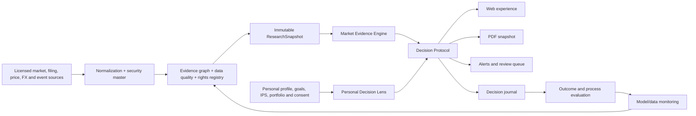

# Global Product Blueprint: เว็บ ฟังก์ชัน และ PDF ที่ขายได้ระดับโลก

วันที่จัดทำ: 9 สิงหาคม 2026  
สถานะ: Product direction สำหรับนำไปออกแบบระบบและแบ่งงานต่อ  
ขอบเขต: Positioning, Website, Product Functions, Data/AI, PDF, Pricing, Trust/Compliance, Roadmap และ Metrics

---

## 1. คำตอบสำหรับผู้บริหาร

ผลิตภัณฑ์นี้ไม่ควรวางตัวเป็น “เว็บดูดวงเลือกหุ้น” และไม่ควรแข่งขันด้วย “PDF หลายหน้า” เพราะสองอย่างนี้เลียนแบบง่าย สร้างความคาดหวังเกินจริง และลดความน่าเชื่อถือเมื่อต้องขยายสู่ตลาดโลก

ตำแหน่งที่ควรยึดคือ:

> **Personal Investment Decision OS — Evidence for the market. Insight for the investor.**  
> ระบบที่ช่วยให้ผู้ใช้เข้าใจหลักฐานของสินทรัพย์ เข้าใจรูปแบบการตัดสินใจของตัวเอง วางกติกาก่อนลงทุน และกลับมาทบทวนด้วยข้อมูลใหม่

ระบบต้องมี “สองรางที่แยกกัน” ชัดเจน:

1. **Market Evidence** — ธุรกิจ งบการเงิน มูลค่า ความเสี่ยง เหตุการณ์ ราคา สภาวะตลาด แหล่งที่มา และความสดของข้อมูล
2. **Personal Decision Lens** — เป้าหมาย สภาพคล่อง ระยะเวลา ความสามารถรับความเสี่ยง พฤติกรรม และ BaZi ในฐานะเครื่องมือสะท้อนตัวเอง

ห้ามนำสองรางไปรวมเป็นคะแนนวิเศษที่อ้างว่า “ดวงนี้เหมาะกับหุ้นนี้ 92%” ผลลัพธ์ที่มีคุณค่าคือ **Decision Protocol** ซึ่งตอบว่า:

- ตอนนี้รู้อะไร
- ยังไม่รู้อะไร
- ความมั่นใจระดับไหน
- ความเสี่ยงหลักคืออะไร
- เงื่อนไขใดจะทำให้มุมมองเปลี่ยน
- ผู้ใช้ควรวิจัย เฝ้าดู ทบทวน หรือเว้นไว้ก่อน
- ต้องกลับมาทบทวนเมื่อไร

เว็บเป็นผลิตภัณฑ์หลัก ส่วน PDF เป็น “สมุดตัดสินใจ ณ เวลาหนึ่ง” ที่สวย กระชับ อ้างอิงได้ และพาผู้ใช้กลับเข้าสู่เว็บ ไม่ใช่การพิมพ์ทุกหน้าจอของระบบออกมา

---

## 2. สิ่งที่ตลาดพิสูจน์แล้ว และช่องว่างที่เราจะยึด

### 2.1 บทเรียนจากผลิตภัณฑ์ระดับโลก

| ผลิตภัณฑ์ | สิ่งที่ทำได้ดี | ช่องว่างที่เราควรใช้ |
|---|---|---|
| [Morningstar Investor / Portfolio X-Ray](https://portfolio.morningstar.com/rtport/reg/xray_landingpage.aspx) | มองพอร์ตแบบองค์รวม ทั้งสินทรัพย์ sector, style, geography, fees และ overlap | แข็งแรงด้านงานวิจัย แต่ไม่ได้สร้างกติกาพฤติกรรมส่วนบุคคลหรือวงจรทบทวนชีวิต |
| [Simply Wall St](https://support.simplywall.st/hc/en-us/articles/360001740916-How-does-the-Snowflake-work) | สรุปบริษัทให้สแกนเร็วด้วยภาพและ 5 มิติ พร้อมพอร์ตและเหตุการณ์สำคัญ | ภาพรวมเข้าใจง่าย แต่คะแนนเดียวอาจซ่อนสมมติฐาน และไม่มีระบบตัดสินใจส่วนบุคคล |
| [TipRanks Smart Portfolio](https://www.tipranks.com/smart-portfolio/analysis/overview) | รวม analyst consensus, sentiment, insider, risk และ benchmark | เด่นด้านการรวมสัญญาณ แต่ยังไม่ใช่ระบบฝึกวินัยและทบทวนกระบวนการของผู้ใช้ |
| [Koyfin Equity Research](https://www.koyfin.com/for-investors/equity-research/) | ข้อมูลลึก หน้าจอปรับแต่งได้ กราฟและ one-pager สำหรับนักลงทุนจริงจัง | ซับซ้อนสำหรับมือใหม่ และไม่ได้เชื่อมเป้าหมายชีวิตกับการตัดสินใจ |
| [TIKR](https://www.tikr.com/) | หุ้นทั่วโลก งบ ประมาณการ valuation filings และ transcripts | ให้ข้อมูลลึก แต่ผู้ใช้ยังต้องแปลงข้อมูลเป็นกติกาที่เหมาะกับตัวเอง |
| [TradingView](https://www.tradingview.com/features/) | กราฟ replay, screener, strategy testing และ alert ที่ทรงพลัง | เหมาะกับการวิเคราะห์/เทรด แต่ผู้ใช้ทั่วไปอาจจมกับเครื่องมือและสัญญาณ |
| [Danelfin](https://danelfin.com/how-it-works) | คะแนน AI มี horizon ชัด แสดงองค์ประกอบและประวัติคะแนน | ยังคงเน้น forecast/score มากกว่าความเหมาะสมต่อชีวิตและพอร์ตของแต่ละคน |
| [Meta BaZi](https://www.metabazi.com/) และ [BaZi Calculator](https://bazi-calculator.app/pricing) | Personalization, timing, chat, หลายภาษา และรายงานถาวร | ไม่มีหลักฐานการลงทุนระดับสถาบัน พอร์ต การตรวจโมเดล และ audit trail |

ข้อสรุปจากตลาดคือ ผู้ใช้ไม่ขาด “ข้อมูล” แต่ขาดการแปลงข้อมูลเป็นคำตอบที่เข้าใจง่าย เห็นสมมติฐาน และนำกลับไปใช้ซ้ำได้ ส่วนผู้ใช้ BaZi มีความต้องการเรื่อง personalization และ timing อยู่แล้ว แต่ตลาดยังไม่มีผลิตภัณฑ์ที่เชื่อมสิ่งนี้กับหลักฐานการลงทุนอย่างรับผิดชอบ

### 2.2 White space ของเรา

พื้นที่ที่ยังไม่มีใครครองชัดเจนคือ:

> **Evidence-grade investing + personal decision behavior + culturally intelligent guidance + auditability**

จุดต่างที่ยั่งยืนไม่ใช่ข้อความหรือภาพที่ AI สร้าง แต่เป็น:

- Evidence graph ของหลักฐาน แหล่งข้อมูล วันที่ ความสด และข้อขัดแย้ง
- ประวัติการตัดสินใจของผู้ใช้แบบต่อเนื่อง
- Personal baseline: เป้าหมาย เงินสำรอง ภาระ ระยะเวลา ความเสี่ยง และข้อจำกัด
- กติกาที่ผู้ใช้ตกลงไว้ก่อนอารมณ์ตลาดเข้ามา
- “What changed?” และ “What would change my mind?”
- Model cards, backtest discipline และ version history
- UX ภาษาไทย–อังกฤษที่เข้าใจทั้งการเงินและบริบทวัฒนธรรม

นี่คือ moat ที่คู่แข่งซึ่งมีแต่ screener, chart หรือ AI chat เลียนแบบได้ยาก

---

## 3. ลูกค้าหลักและงานที่เขาจ้างเราให้ทำ

### กลุ่ม A — คนเริ่มลงทุนที่มีเงินจริง แต่ยังไม่มีระบบ

งานที่ต้องการ: “ช่วยย่อสิ่งสำคัญ บอกว่าต้องดูอะไรต่อ และกันฉันจากการตัดสินใจด้วยความกลัวหรือความโลภ”

### กลุ่ม B — นักลงทุนทำงานประจำที่ไม่มีเวลาติดตาม

งานที่ต้องการ: “บอกเฉพาะสิ่งที่เปลี่ยนและมีผลต่อ thesis หรือพอร์ต อย่าส่งข่าวรบกวนทั้งวัน”

### กลุ่ม C — นักลงทุนที่เชื่อเรื่อง timing/BaZi แต่ต้องการความน่าเชื่อถือ

งานที่ต้องการ: “ใช้ BaZi ช่วยสะท้อนจังหวะและพฤติกรรม แต่แยกจากข้อเท็จจริงของบริษัทอย่างโปร่งใส”

### กลุ่ม D — ผู้ใช้พรีเมียมที่ต้องการ continuity

งานที่ต้องการ: “จำข้อมูลฉัน ติดตามพอร์ต ทบทวนกติกา และแสดงความเปลี่ยนแปลงทุกเดือน ไม่ใช่ขายไฟล์ครั้งเดียวแล้วจบ”

ไม่ควรเริ่มจาก trader มืออาชีพหรือสถาบัน เพราะจะดึงผลิตภัณฑ์ไปสู่การแข่งขันด้าน latency, execution และ data terminal ซึ่งใช้ทุนสูงและไม่ใช่ความได้เปรียบของเรา

---

## 4. Brand และข้อความขาย

### 4.1 Brand architecture

ชื่อ “ดวงนักลงทุน / Bazi Investor Guide” ใช้เป็นช่องทางเข้าตลาดไทยได้ แต่แบรนด์หลักระดับโลกควรนำด้วยความไว้วางใจ แล้วระบุ BaZi เป็น methodology/module เช่น:

- Master brand: **Decision Compass** หรือ **Elemental Investor** — ต้องทดสอบชื่อและเครื่องหมายการค้าก่อนใช้จริง
- Product descriptor: **Personal Investment Decision OS**
- Module: **BaZi Personal Decision Lens**
- Tagline: **Evidence for the market. Insight for the investor.**

### 4.2 Hero message ที่ควรใช้

ตัวอย่าง:

> เห็นหลักฐานของหุ้น เข้าใจพฤติกรรมของตัวเอง และมีกติกาก่อนตัดสินใจ  
> รับคำตอบ 3 ข้อ ความเสี่ยง 3 ข้อ และแผนทบทวนถัดไป — พร้อมแหล่งข้อมูลทุกครั้ง

CTA หลัก: **ลองวิเคราะห์ตัวอย่าง**  
CTA รอง: **ดูรายงานตัวอย่างจริง**

อย่าเริ่มหน้าแรกด้วยศัพท์ BaZi, คะแนนหลายชุด, ตาราง feature หรือ emoji card จำนวนมาก ผู้ซื้อควรเข้าใจคุณค่าใน 5–10 วินาทีแรก

---

## 5. โครงสร้างเว็บไซต์ที่ควรเป็น

Navigation หลักควรเหลือ:

1. **Today**
2. **Research**
3. **Portfolio**
4. **Journal**
5. **Reports**
6. **Trust**

Profile, pricing, help และ settings อยู่ในเมนูบัญชี ไม่ควรแย่งพื้นที่การตัดสินใจหลัก

### 5.1 Home

- Hero: ปัญหาเดียว คำมั่นเดียว CTA เดียว
- Interactive demo: เลือกหุ้นตัวอย่าง แล้วเห็น “ก่อนมีระบบ / หลังมีระบบ”
- แสดง Decision Card จริงหนึ่งใบ ไม่ใช่ภาพ mockup ที่อ่านไม่ได้
- How it works 3 ขั้น: Understand yourself → Examine evidence → Decide by rule
- Trust strip: data as-of, citations, model version, privacy, “ไม่ใช่ผลตอบแทนที่รับประกัน”
- Pricing ที่อธิบายความต่อเนื่องและสิทธิ์ ไม่ใช่จำนวนหน้า
- Social proof ใช้ผลลัพธ์ด้านความชัดเจน/ประหยัดเวลา ไม่ใช้คำอวดผลตอบแทน

### 5.2 Today — Decision Inbox

หน้าแรกหลังล็อกอินต้องมีไม่เกิน 3 เรื่อง:

- อะไรเปลี่ยนตั้งแต่ครั้งล่าสุด
- ทำไมจึงเกี่ยวกับ thesis/พอร์ต/เป้าหมายของผู้ใช้
- ต้องทำอะไรต่อ หรือยังไม่ต้องทำอะไร

ไม่ควรเป็น news feed และไม่ควรทำให้ผู้ใช้รู้สึกว่าต้องเทรดทุกวัน

### 5.3 Research

หน้า security หนึ่งตัวต้องตอบตามลำดับ:

1. บริษัทหาเงินอย่างไร
2. อะไรขับเคลื่อนกำไร
3. คุณภาพธุรกิจและงบเป็นอย่างไร
4. ตลาดกำลังคาดหวังอะไรในราคา
5. ความเสี่ยงและสิ่งที่ยังไม่รู้
6. Bull / Base / Bear scenario
7. เหตุการณ์ที่ต้องเฝ้าดู
8. หุ้นนี้มี “บทบาท” อะไรในพอร์ต ไม่ใช่แค่ดีหรือไม่ดี
9. อะไรจะทำให้มุมมองเปลี่ยน
10. แหล่งข้อมูล ความสด ความมั่นใจ และเวอร์ชัน

### 5.4 Portfolio Lab

- Allocation เทียบเป้าหมาย
- Concentration, overlap และ correlated bets
- Sector, geography, currency และ factor exposure
- Drawdown/risk capacity stress
- Goal buckets และ liquidity
- Scenario: รายได้ลด ดอกเบี้ยขึ้น ค่าเงินเปลี่ยน ตลาดลง
- Rebalancing range ที่ผู้ใช้กำหนดเอง
- อธิบาย “พอร์ตเสี่ยงเพราะอะไร” เป็นภาษาคน

### 5.5 Timing / Pattern Lab

ใช้ได้เมื่อผ่านมาตรฐานโมเดลเท่านั้น:

- ระบุ horizon และ benchmark
- แสดง sample size, hit rate, calibration, costs และช่วงความไม่แน่นอน
- แยก in-sample, walk-forward และ out-of-sample
- แสดง regime ที่โมเดลเคยพลาด
- ใช้คำว่า “ความน่าจะเป็น/เงื่อนไขทบทวน” ไม่ใช้ “จุดสูงสุดแน่นอน”

### 5.6 Decision Journal

- Thesis ก่อนตัดสินใจ
- เหตุผลที่ซื้อ/ไม่ซื้อ
- สมมติฐานและหลักฐาน
- Invalidation rule
- ขนาดความเสี่ยงที่ยอมรับ
- วันที่ทบทวน
- ผลลัพธ์ภายหลัง
- Process score แยกจาก return score

นี่เป็นฟังก์ชันสำคัญมาก เพราะสะสมข้อมูลเฉพาะบุคคลและทำให้ผลิตภัณฑ์มีค่ามากขึ้นเมื่อใช้นานขึ้น

### 5.7 Goals & IPS

[CFA Institute](https://rpc.cfainstitute.org/policy/positions/elements-of-an-investment-policy-statement-for-individual-investors) เสนอให้ Investment Policy Statement รวมเป้าหมาย ความเสี่ยง การกำกับ ติดตาม และรายงานไว้เป็นแนวทาง โดยเฉพาะช่วงตลาดผันผวน ระบบเราควรสร้าง IPS ที่อ่านง่ายและแก้ไขได้จาก:

- เงินสำรองและหนี้
- เป้าหมายและเส้นเวลา
- Risk willingness เทียบ risk capacity
- Liquidity, tax และข้อจำกัด
- Asset allocation range
- กติกาซื้อ เพิ่ม ลด และทบทวนที่ผู้ใช้เป็นเจ้าของ

### 5.8 Reports

- เก็บ snapshot ที่แก้ย้อนหลังไม่ได้
- เปรียบเทียบรายงานสองฉบับด้วย delta
- แสดงข้อมูล/โมเดล/กติกาที่เปลี่ยน
- มี deep link กลับหน้าจอ live
- ดาวน์โหลด PDF ได้ทุกเวอร์ชันที่ซื้อ

### 5.9 Trust Center

- Data coverage แยกตลาดและชนิดข้อมูล
- Data source, commercial rights และ refresh cadence
- Model cards และข้อจำกัด
- Backtest methodology
- Changelog
- Privacy, consent, export และ delete
- Conflict/error disclosure
- Legal status และขอบเขตบริการ

Trust Center ไม่ใช่หน้ากฎหมายที่ซ่อนไว้ท้ายเว็บ แต่เป็นส่วนหนึ่งของ product value

---

## 6. หน่วยข้อมูลกลาง: Decision Object

ทุกหน้า ทุก PDF ทุก alert และทุกคำตอบ AI ควรสร้างจาก object เดียว:

| Field | หน้าที่ |
|---|---|
| Question | คำถามจริงที่ผู้ใช้กำลังตัดสินใจ |
| Status | Research / Watch / Review / Avoid for now |
| Answer | คำตอบสั้นหนึ่งย่อหน้า |
| Evidence | หลักฐานสนับสนุนและหลักฐานคัดค้าน |
| Confidence | ระดับความมั่นใจพร้อมเหตุผล |
| Unknowns | สิ่งที่ยังไม่มีข้อมูลหรือข้อมูลขัดแย้ง |
| Risks | ความเสี่ยงต่อ thesis และต่อผู้ใช้ |
| Change conditions | อะไรจะทำให้มุมมองเปลี่ยน |
| Next action | งานถัดไปหรือ “ยังไม่ต้องทำอะไร” |
| Review date | วัน/เหตุการณ์ที่ต้องกลับมา |
| Provenance | source, as-of, version, rights |

เมื่อมี object นี้ ระบบจะไม่เขียนซ้ำไปมา เพราะแต่ละองค์ประกอบมีหน้าที่ชัด และ PDF/web จะแสดงข้อมูลเดียวกันในรูปแบบต่างกัน

---

## 7. ฟังก์ชันทั้งหมดและลำดับความสำคัญ

### P0 — Foundation ที่ต้องมี ก่อนขายคำแนะนำพรีเมียม

- Security master: ticker, exchange, ISIN/LEI, currency และ lifecycle
- Evidence graph: claim ↔ source ↔ as-of ↔ confidence ↔ conflict
- Licensed fundamentals, EOD, corporate actions, FX และ market calendar
- Data freshness/quality/rights registry
- Immutable ResearchSnapshot
- Personal financial profile และ consent
- Portfolio/transaction schema
- Model registry และ model card
- Prompt/model/version audit log
- Compliance-language validator
- Privacy: export/delete/retention/access control
- Design tokens และ accessible component library

หมายเหตุสำคัญ: “มีวันที่ครบ 100% ของแถว” ไม่เท่ากับ “ยืนยันจากแหล่งทางการครบ 100%” ต้องแสดง coverage แยกเป็น presence, verified, confidence และ commercial-use rights

### P1 — Core loop ที่ทำให้ลูกค้าได้รับคุณค่าจริง

- Guided onboarding: วันเกิด + เป้าหมาย + สถานะการเงิน + พอร์ต + horizon + risk
- Today decision inbox
- Research one-pager หุ้น/ETF
- Watchlist พร้อม user-authored conditions
- Portfolio diagnostic
- Goal buckets และ IPS
- Thesis/decision journal
- Source/confidence drawer
- PDF snapshot + delta report
- Alert เฉพาะเมื่อ thesis, risk หรือ condition เปลี่ยน
- Thai/English localization

### P2 — ตัวต่างที่ทำให้คนย้ายมาใช้เรา

- Dual-lens view: Market Evidence กับ Personal Decision Lens วางคู่กันแต่ไม่ผสมคะแนน
- “What changed since last review?”
- “What would change my mind?”
- Personalized bias guardrails
- Life-event scenario lab
- Counterfactual review: ถ้าทำตามกติกาของตัวเอง ผลและความเสี่ยงต่างอย่างไร
- Decision-quality score ที่วัดกระบวนการ ไม่ใช่ทายถูกครั้งเดียว
- Citation-aware AI research assistant
- Monthly personal baseline และ drift
- Report continuity: update rights, history และ comparison

### P3 — Advanced หลังมีข้อมูลและการตรวจโมเดลเพียงพอ

- Walk-forward Pattern Lab
- Regime/stress analysis
- Custom valuation assumptions และ sensitivity
- Filing/transcript claim extraction
- Broker import หลังผ่าน privacy/security/legal review
- Advisor/team mode หลังโครงสร้างใบอนุญาตชัดเจน
- API สำหรับ partner ที่ผ่าน data-rights review

### สิ่งที่ไม่ควรสร้างตอนนี้

- คำสั่งซื้อ/ขายเฉพาะบุคคลพร้อมราคาและเวลาตายตัว
- คำอ้าง “จับจุดสูงสุด/ต่ำสุด”
- คะแนนรวม BaZi + หุ้น
- AI art เฉพาะทุกหุ้นทุกหน้า
- Auto-trading หรือ execution
- Feed ข่าวรายวันจำนวนมาก
- Leaderboard ผลตอบแทนที่ไม่มี methodology
- Backtest ที่เลือกช่วงสวยที่สุดแล้วซ่อนต้นทุน/ความล้มเหลว

---

## 8. Architecture ที่รองรับคุณภาพและการขยายทั่วโลก

หลักสำคัญ:

- Calculation และข้อมูลต้นทางเป็น deterministic/structured ก่อน
- LLM มีหน้าที่สรุป อธิบาย และถามกลับ โดยต้องอ้าง claim ID
- หาก source, as-of หรือ confidence ขาด ระบบต้อง fail closed ไม่แต่งคำตอบ
- รูปแบบเว็บและ PDF อ่านจาก snapshot เดียวกัน
- ทุกผลลัพธ์มี model/prompt/data version และ reproducible snapshot ID
- แยก market engine ออกจาก personal lens ในโค้ด ฐานข้อมูล และ UI

### Global security data

สำหรับหุ้นต่างประเทศต้องมี lifecycle ไม่ใช่แค่ “วันเกิดบริษัท”:

- incorporation/founding date
- legal entity
- IPO/pricing/first trading date
- exchange/ticker changes
- ADR/GDR/primary listing relationship
- merger, spin-off, reverse merger และ relisting
- timezone และ confidence ของเวลา

ถ้าไม่รู้เวลา ให้ใช้ date-only พร้อม uncertainty; ห้ามสมมติเวลาเที่ยงแล้วแสดงเป็นข้อเท็จจริง ระบบ BaZi สำหรับหลักทรัพย์ควรลดระดับความมั่นใจตามคุณภาพเหตุการณ์ต้นทาง

---

## 9. Pricing: ขายความลึก ความต่อเนื่อง และสิทธิ์ ไม่ขายจำนวนหน้า

| Tier | สิ่งที่ลูกค้าควรได้รับ |
|---|---|
| **Free** | Web profile เบื้องต้น, watchlist 3–5 ตัว, PDF 4 หน้า, personal pattern 1 เรื่อง, security sample 1 ตัว, แผน 7 วัน และเห็นคุณภาพการอ้างอิงจริง |
| **฿99 Money Playbook** | PDF 8 หน้า, risk willingness/capacity, money buckets, แผน 30 วัน, research card 1 ตัว, ประวัติ 30 วัน |
| **฿490 Private Plan** | PDF 14–16 หน้า, financial baseline, IPS, portfolio diagnostic, research 2 ตัว, scenario lab, source ledger, access 60 วัน |
| **฿790 Private Continuity** | PDF 18–22 หน้า, research 3–5 ตัว, confidence/model appendix, journal, delta report, alerts, update/regeneration 1 ครั้ง และ access 90 วัน |

ราคาแพงขึ้นต้องต่างกันที่:

- จำนวนสินทรัพย์และพอร์ตที่รองรับ
- ความลึก/ความสดของข้อมูล
- interactive tools
- saved history
- alert และ review cadence
- สิทธิ์อัปเดตหรือสร้างใหม่
- Q&A/support
- model/source transparency

ไม่ควรให้ Free เป็นตัวอย่างแย่ เพราะจะพิสูจน์เพียงว่า “ของเราไม่ดี” Free ต้องแก้ปัญหาเล็กหนึ่งเรื่องให้จบ ส่วน paid แก้ปัญหากว้างขึ้นและต่อเนื่องขึ้น

สำหรับตลาดโลก ภายหลังสามารถทดสอบ Free / Core subscription / Pro Continuity / one-off report add-on แต่ต้องสัมภาษณ์และทดสอบ willingness to pay ก่อนกำหนดราคา

---

## 10. PDF ที่ควรเป็น

### 10.1 ผลตรวจฉบับปัจจุบัน

ไฟล์ `output/pdf/bazi-report-790-editorial-v7.2.pdf` มี 32 หน้า A4 ทิศทางใหม่ดีขึ้นมาก: สีสม่ำเสมอ ตัวอักษรไทยอ่านง่าย และไม่พบภาพทับข้อความในการตรวจครบทุกหน้า

ปัญหาที่ยังเหลือ:

- 32 หน้ายาวเกินคุณค่าที่ผู้ใช้อ่านจบได้จริง
- หลายหน้าเป็น “โปสเตอร์หนึ่งประเด็น” มีพื้นที่ว่างมาก
- worksheet, scenario controls, watchlist, drift และ journal ถูกพิมพ์เป็นหน้าคงที่ ทั้งที่ควรเป็นฟังก์ชันเว็บ
- จังหวะเนื้อหายังเหมือนชุด one-pager มากกว่าหนังสือตัดสินใจที่ผ่านการบรรณาธิการ
- PDF ยังไม่ tagged จึงมีปัญหา accessibility, reading order และการใช้ screen reader

### 10.2 จำนวนหน้าที่เหมาะสม

- Free: 4 หน้า
- ฿99: 8 หน้า
- ฿490: 14–16 หน้า
- ฿790: 18–22 หน้า

คุณภาพไม่ได้วัดด้วยจำนวนหน้า แต่ด้วยจำนวนคำถามสำคัญที่ตอบได้ชัดเจน

### 10.3 โครงสร้าง PDF พรีเมียม 18 หน้า

1. Cover, owner, as-of, version และ snapshot ID
2. **In 60 seconds:** 3 คำตอบ 3 ความเสี่ยง 3 การกระทำ
3. Confidence, data gaps และวิธีอ่าน
4. Personal decision pattern และ bias guardrails
5. Financial reality และ goal gap
6. Risk willingness เทียบ capacity
7. IPS และกติกาส่วนตัว
8. Portfolio X-ray
9. Market regime/pattern confidence
10. Security one-pager ตัวที่ 1
11. Security one-pager ตัวที่ 2
12. Security one-pager ตัวที่ 3
13. Comparison และบทบาทในพอร์ต
14. Bull/Base/Bear และ stress
15. Timing probabilities, sample และข้อจำกัด
16. แผน 30/90 วัน
17. Review checklist และ decision journal snapshot
18. Change log, sources, model card และ legal boundary

Appendix เพิ่มได้เมื่อข้อมูลมีประโยชน์จริง ไม่ใช่เพื่อเพิ่มหน้า

### 10.4 Page grammar

ทุกหน้าต้องมีลำดับเดียว:

> **Question → Answer → Evidence → Uncertainty → Action**

หนึ่งหน้ามี takeaway หลักหนึ่งเรื่อง ตารางมีเมื่อช่วยเปรียบเทียบจริง และต้องไม่เล่าข้อความเดิมซ้ำในย่อหน้าใต้ตาราง

### 10.5 Visual system

- Mood: editorial, calm, premium, evidence-led
- Palette: ivory + deep ink + jade + cinnabar; หลีกเลี่ยง purple/gold แบบเว็บดูดวงทั่วไป
- Body ไทยอย่างน้อยประมาณ 11.5–12 pt
- Section heading 15–18 pt; chapter title 28–36 pt
- Content page ใช้พื้นที่โดยประมาณ 55–75% ไม่ปล่อยช่องว่างโดยไม่มีหน้าที่
- ใช้กราฟข้อมูลจริง ไม่ใช้ภาพ AI แทนกราฟ
- ไม่สื่อสถานะด้วยสีเพียงอย่างเดียว
- ทุก chart มี takeaway, unit, period, source และ as-of
- มี QR/deep link ไปหน้าข้อมูล live

เว็บควรผ่าน WCAG 2.2 AA โดยข้อความปกติมี contrast อย่างน้อย 4.5:1 ตาม [W3C](https://www.w3.org/WAI/WCAG21/Understanding/contrast-minimum) ส่วน PDF ควรมี tags, reading order, bookmarks, heading/table structure, alt text และ actual text ตามแนวทาง [PDF Association](https://pdfa.org/accessibility/) และ [W3C PDF reading order](https://www.w3.org/TR/WCAG20-TECHS/PDF3.html)

---

## 11. กลยุทธ์ AI และรูปภาพ

### 11.1 AI ควรทำอะไร

- อธิบาย structured evidence เป็นภาษาคน
- สรุปความขัดแย้งระหว่างแหล่ง
- ปรับระดับภาษาและบริบทให้ผู้ใช้
- ช่วยตั้งคำถามและกติกาทบทวน
- สร้าง draft โดยอ้าง claim ID
- ตรวจความซ้ำ ความกำกวม และ compliance language

### 11.2 AI ไม่ควรทำอะไร

- คิดตัวเลขหรือแหล่งข้อมูลเอง
- สร้างกราฟจากจินตนาการ
- เปลี่ยน uncertainty เป็นความแน่นอน
- รวม BaZi กับ market model โดยไม่มีหลักฐาน
- อ้างว่าจะเพิ่มผลตอบแทน

[NIST AI Risk Management Framework](https://www.nist.gov/itl/ai-risk-management-framework) เน้นความน่าเชื่อถือ ความโปร่งใส การอธิบายได้ ความรับผิดชอบ ความเป็นส่วนตัว และการประเมินซ้ำ ระบบจึงต้องมี model card ระบุ intended use, ข้อจำกัด, ชุดทดสอบ, horizon, benchmark, version และ failure modes ตามแนวคิด [Model Cards](https://research.google/pubs/model-cards-for-model-reporting/)

### 11.3 รูปภาพ

- ใช้ภาพปกหนึ่งภาพจาก visual system ธาตุทั้งห้า
- ใช้ editorial diagram/illustration ที่คัดแล้ว 3–5 แบบทั้งเล่ม
- กราฟทั้งหมดสร้างจากข้อมูลด้วย SVG/Canvas
- cache ภาพตาม template, palette, seed และ profile family
- version prompt/model/asset และตรวจตัวอย่างโดยมนุษย์
- ไม่ต้อง generate ภาพใหม่ทุกหุ้นหรือทุกหน้า

ภาพสร้างบรรยากาศได้ แต่ไม่ควรเป็นต้นทุนหลักหรือคำตอบเรื่องคุณภาพ

---

## 12. กฎหมายและขอบเขตผลิตภัณฑ์

ประเด็นนี้ต้องผ่านทนายไทย/ที่ปรึกษา ก.ล.ต. ก่อนเปิดขายฟังก์ชันที่ personalized สูง รายการต่อไปนี้เป็น product risk boundary ไม่ใช่คำวินิจฉัยทางกฎหมาย

[ข้อมูลของ ก.ล.ต. ไทยเรื่อง Investment Advisory](https://capital.sec.or.th/webapp/nrs/nrs_search_en.php?cat_id=305&chk_frm=1&ref_id=400&topic_desc=Investment+Advisory) และ [กรอบใบอนุญาตที่เกี่ยวข้อง](https://www.sec.or.th/EN/Pages/LawandRegulations/MinistrialRegulationSEAArchive-c.aspx) ทำให้ต้องระวังบริการที่เข้าลักษณะคำแนะนำซื้อขายเฉพาะบุคคล โดยเฉพาะเมื่อเก็บเงิน

หลักปฏิบัติในระบบ:

- ใช้ Research / Watch / Review / Avoid for now แทน Buy/Sell
- ให้ผู้ใช้เป็นผู้กำหนด alert และ decision rule
- แสดง benefits คู่กับ risks และ limitations
- ห้ามรับประกันผลตอบแทนหรือจุดสูงสุด
- แยก educational research ออกจาก personalized advice
- เก็บหลักฐานของทุก claim และข้อความโฆษณา
- hypothetical/backtest ต้องมี methodology, costs, benchmark, sample และข้อจำกัด
- AI claim ต้องบอกตรงว่า AI ทำอะไรจริง

หลักดังกล่าวสอดคล้องกับ [SEC Marketing Rule](https://www.sec.gov/resources-small-businesses/small-business-compliance-guides/investment-adviser-marketing), คำเตือนเรื่อง [AI washing](https://www.sec.gov/newsroom/speeches-statements/sec-chair-gary-gensler-ai-washing) และแนวทาง [FINRA เรื่อง automated investment tools](https://www.finra.org/investors/alerts/automated-investment-tools)

ถ้าธุรกิจต้องการให้คำแนะนำซื้อ/ขายเฉพาะบุคคลจริง ต้องออกแบบนิติบุคคล ใบอนุญาต บุคลากร supervision, suitability, recordkeeping และ data rights ให้ถูกต้องก่อน ไม่ใช่แก้ด้วย disclaimer ท้ายหน้า

---

## 13. มาตรฐาน Pattern/Prediction ก่อนเปิดให้ลูกค้าใช้

งานวิจัยเรื่อง [Probability of Backtest Overfitting](https://www.davidhbailey.com/dhbpapers/backtest-prob.pdf) ชี้ความเสี่ยงจากการทดลองหลายกลยุทธ์แล้วเลือกเฉพาะผลสวย ดังนั้นโมเดล timing ทุกตัวต้องผ่าน:

- นิยาม hypothesis ล่วงหน้า
- benchmark และ horizon ชัด
- transaction costs/slippage
- train/validation/test แยก
- walk-forward และ out-of-sample
- multiple-testing control
- calibration ของ probability
- stability across market regimes
- failure mode และ drawdown
- versioning และ monitoring หลังใช้งาน
- publication gate โดยคนที่ไม่ได้สร้างโมเดลเพียงคนเดียว

ผลลัพธ์ต้องแสดงเป็นความน่าจะเป็นและช่วงความไม่แน่นอน ห้ามแสดงเส้นอนาคตเส้นเดียวให้ดูเหมือนข้อเท็จจริง

เพื่อไม่ให้ข้อมูล “บวม” ให้เก็บ raw licensed data ตามสิทธิ์, feature/model run, metrics, snapshot ID และ chart specification ไม่ต้องเก็บ PNG ของกราฟทุกตัวทุกวัน กราฟสามารถ render ใหม่จาก snapshot ได้

---

## 14. Roadmap ที่ควรทำก่อน PDF รุ่นถัดไป

### Phase 0 — Trust and Data Foundation (0–6 สัปดาห์)

- ตัดสิน legal boundary และ data rights
- สร้าง security master/evidence graph/ResearchSnapshot
- กำหนด model card และ compliance rules
- สร้าง personal/portfolio schema
- สร้าง design system และ Decision Object
- เปลี่ยน homepage ให้ขายคำมั่นเดียว

**Gate:** แหล่งข้อมูลและสิทธิ์ชัด, snapshot reproduce ได้, claim ไม่มีที่มาไม่ได้

### Phase 1 — Core Decision Loop (6–12 สัปดาห์)

- Onboarding
- Today
- Research one-pager
- Watchlist/conditions
- Journal
- Free และ ฿99 PDF

**Gate:** ผู้ใช้ใหม่ได้ insight แรกภายใน 5 นาที และเข้าใจ next action โดยไม่ต้องมีคนอธิบาย

### Phase 2 — Portfolio and Continuity (12–20 สัปดาห์)

- Portfolio Lab
- IPS/risk capacity
- Scenario Lab
- ฿490/฿790 PDF
- Delta report, alerts, review cadence

**Gate:** ข้อมูลพอร์ต reconcile ได้, รายงานไม่ใช้ demo data ในงานขาย, visual/accessibility QA ผ่าน

### Phase 3 — Validated Intelligence (20–32 สัปดาห์)

- Pattern Lab ที่ผ่าน walk-forward
- Model monitoring
- Multilingual trust center
- Advisor/legal pilot

**Gate:** out-of-sample, calibration, costs, failure modes และ legal approval ครบ

### Phase 4 — Global Scale

- Broker sync
- Global subscription
- Partner/API
- Region-specific compliance และ localization

ลำดับนี้หมายความว่า **ระบบแกนกลางต้องมาก่อนการเพิ่มหน้า PDF** PDF รุ่นใหม่ควรทำหลัง Decision Object และ ResearchSnapshot นิ่ง เพื่อไม่ต้องเขียน logic ซ้ำและเพื่อให้ทุก tier อัปเดตได้

---

## 15. Metrics ที่บอกว่าผลิตภัณฑ์มีคุณค่าจริง

### North Star

> สัดส่วนผู้ใช้ที่ทำ review action ตามแผน บันทึกเหตุผล และกลับมาอัปเดตการตัดสินใจ

### Activation และธุรกิจ

- Time to first useful insight ต่ำกว่า 5 นาที
- Onboarding completion
- Demo → account → first saved decision
- Watchlist/portfolio connected
- Free → paid conversion
- 7/30/90-day retention
- Delta report reopen
- Refund rate
- Referral/share แบบไม่เปิดข้อมูลส่วนตัว

### Customer value

- ความชัดเจนก่อน/หลังใช้
- เวลาวิจัยที่ประหยัดได้
- จำนวนการตัดสินใจนอกกติกา/FOMO ที่ลดลง
- Journal adherence
- Process score improvement

### Trust/model

- Citation coverage และ citation click
- Stale data rate
- Conflict/error rate
- Unsupported-claim/hallucination rate
- Model calibration/Brier score
- Out-of-sample stability
- Compliance incidents ต้องเป็นศูนย์
- PDF accessibility/visual regression pass rate

อย่าวัดความสำเร็จด้วยจำนวนหน้า จำนวนคำตอบ AI หรือ hit rate ของหุ้นเพียงอย่างเดียว

---

## 16. สิ่งที่ต้องลด เพิ่ม และเก็บไว้

### ลด

- หน้า PDF ที่มีหนึ่งประโยคกับพื้นที่ว่างมาก
- ตารางที่พูดข้อความเดิมซ้ำ
- emoji/card wall บนหน้าเว็บ
- คำทำนายที่ดูแน่นอน
- feature ที่สร้าง engagement แต่ไม่ช่วยตัดสินใจ
- demo data ในงานพรีเมียม

### เพิ่ม

- คำตอบสั้นก่อนรายละเอียด
- หลักฐานคัดค้านและ unknowns
- confidence/source/as-of ทุกจุด
- change conditions และ review date
- พอร์ต เป้าหมาย risk capacity และ IPS
- history/delta/journal
- Trust Center และ model card
- accessibility และ mobile-first reading

### เก็บและพัฒนาต่อ

- editorial palette ปัจจุบัน
- executive answer
- confidence/data limitation
- research comparison
- 30/90/365 action plan
- source ledger
- แนวคิด decision journal

---

## 17. ข้อเสนอการตัดสินใจทันที

1. อนุมัติ positioning “Personal Investment Decision OS”
2. ยืนยันว่า BaZi เป็น Personal Decision Lens ไม่ใช่เครื่องทำนายราคา
3. หยุดเพิ่มหน้า PDF ชั่วคราว
4. ทำ Decision Object + ResearchSnapshot + Trust schema เป็นแกน
5. ยุบ homepage ให้เหลือ one promise + live demo
6. ทำ P1 loop ให้จบ ก่อนเพิ่ม Pattern Lab
7. ให้ legal/data-rights review เป็น release gate
8. ทดสอบกับผู้ใช้ 8–12 คนต่อ segment โดยให้ทำโจทย์จริง ไม่ถามเพียงว่าสวยหรือไม่
9. สร้าง PDF ใหม่ 4/8/16/20 หน้า จาก snapshot เดียวกับเว็บ
10. วัด decision clarity, time saved และ return-to-review เป็นหลัก

---

## แหล่งวิจัยหลัก

### Products

- [Morningstar Investor launch and product direction](https://newsroom.morningstar.com/news/news-details/2022/Morningstar-Investor-Connects-Individual-Investors-Portfolio-Management-to-Morningstar-Research/default.aspx)
- [Morningstar Portfolio X-Ray](https://portfolio.morningstar.com/rtport/reg/xray_landingpage.aspx)
- [Simply Wall St Snowflake methodology](https://support.simplywall.st/hc/en-us/articles/360001740916-How-does-the-Snowflake-work)
- [Simply Wall St plans](https://simplywall.st/plans)
- [TipRanks Smart Portfolio](https://www.tipranks.com/smart-portfolio/analysis/overview)
- [Koyfin equity research](https://www.koyfin.com/for-investors/equity-research/)
- [TIKR global equity research](https://www.tikr.com/)
- [TradingView features](https://www.tradingview.com/features/)
- [Danelfin methodology](https://danelfin.com/how-it-works)
- [Meta BaZi](https://www.metabazi.com/)
- [BaZi Calculator pricing](https://bazi-calculator.app/pricing)

### Investor process and trust

- [CFA Institute: Elements of an IPS](https://rpc.cfainstitute.org/policy/positions/elements-of-an-investment-policy-statement-for-individual-investors)
- [CFA Institute: Behavioral biases](https://www.cfainstitute.org/insights/professional-learning/refresher-readings/2026/the-behavioral-biases-of-individuals)
- [Investor.gov: Risk tolerance](https://www.investor.gov/introduction-investing/investing-basics/save-and-invest/gauge-your-risk-tolerance)
- [Morningstar: Mind the Gap 2025](https://www.morningstar.com/en-us/business/insights/research/mind-the-gap)

### AI, model quality, accessibility and compliance

- [NIST AI Risk Management Framework](https://www.nist.gov/itl/ai-risk-management-framework)
- [Model Cards for Model Reporting](https://research.google/pubs/model-cards-for-model-reporting/)
- [Probability of Backtest Overfitting](https://www.davidhbailey.com/dhbpapers/backtest-prob.pdf)
- [WCAG 2.2](https://www.w3.org/WAI/standards-guidelines/wcag/new-in-22/)
- [PDF accessibility](https://pdfa.org/accessibility/)
- [Thai SEC: Investment Advisory](https://capital.sec.or.th/webapp/nrs/nrs_search_en.php?cat_id=305&chk_frm=1&ref_id=400&topic_desc=Investment+Advisory)
- [U.S. SEC: Investment Adviser Marketing](https://www.sec.gov/resources-small-businesses/small-business-compliance-guides/investment-adviser-marketing)
- [FINRA: Automated Investment Tools](https://www.finra.org/investors/alerts/automated-investment-tools)

---

## Final principle

ลูกค้าจะไม่กลับมาเพราะ PDF ยาวหรือ AI เขียนเก่ง แต่จะกลับมาเมื่อผลิตภัณฑ์:

1. จำบริบทของเขาได้
2. ลดเวลาจากข้อมูลจำนวนมากให้เหลือเรื่องที่ต้องตัดสินใจ
3. แสดงหลักฐานและความไม่แน่นอนอย่างซื่อสัตย์
4. กันเขาจากการตัดสินใจที่ผิดกติกาของตัวเอง
5. บอกสิ่งที่เปลี่ยนและพากลับมาทบทวนในเวลาที่เหมาะสม

ถ้าทำห้าข้อนี้ได้ เว็บคือบริการต่อเนื่องที่มี moat และ PDF คือหลักฐานคุณภาพของระบบ ไม่ใช่ตัวระบบทั้งหมด
