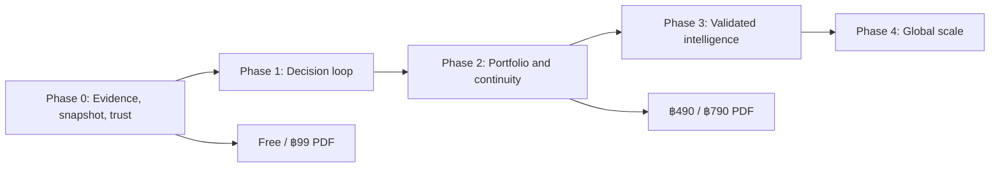

# Implementation Phases — Personal Investment Decision OS

วันที่เริ่ม: 9 สิงหาคม 2026  
เอกสารต้นทาง: `docs/global-product-blueprint-web-pdf-functions-2026-08-09.md`  
หลักการส่งมอบ: จบทีละ Phase เมื่อผ่าน release gate เท่านั้น ไม่เพิ่มหน้า PDF เพื่อกลบช่องว่างของระบบ

## ภาพรวม

| Phase | เป้าหมาย | สถานะ |
|---|---|---|
| Phase 0 | Trust & Data Foundation | ฐานโค้ด Sprint 0A–0E เสร็จ · official listing 71.95% · commercial/production gate ยังไม่ผ่าน |
| Phase 1 | Core Decision Loop | รอ licensed data, legal operating model, account auth และ production persistence |
| Phase 2 | Portfolio & Continuity | รอ Phase 1 |
| Phase 3 | Validated Intelligence | รอข้อมูลและ model validation |
| Phase 4 | Global Scale | รอ product-market fit และ compliance รายประเทศ |

---

## Phase 0 — Trust & Data Foundation

### เป้าหมาย

ทำให้เว็บ, API, AI และ PDF อ่านข้อมูลจากโครงสร้างกลางเดียวกัน มีหลักฐาน ตรวจย้อนกลับได้ และปิดผลลัพธ์ที่ไม่พร้อมเผยแพร่

### Deliverables

- Decision Object schema: question, answer, status, claims, confidence, unknowns, risks, change conditions, next action และ provenance
- Claim-to-evidence graph ที่ตรวจ orphan claim ได้
- ResearchSnapshot รุ่นใหม่ที่บรรจุ Decision Object แบบ content-addressed
- Runtime validation และ public-language guardrail
- Model registry/model cards ขั้นต้น
- Trust Center แสดง coverage, release gates, model status และข้อจำกัด
- แผนข้อมูลส่วนบุคคล/พอร์ตและ consent boundary
- Homepage direction และ design tokens สำหรับ Phase 1

### Release gate

- ทุก public claim มี evidence reference หรือถูกระบุว่าเป็น unknown
- snapshot เดิมสร้างซ้ำแล้วได้ content identity เดิม
- BaZi ไม่เปลี่ยน market status/score
- development-only หรือสิทธิ์ไม่ชัดไม่ผ่าน public release
- model/version/as-of ติดไปกับผลลัพธ์
- tests, typecheck และ production build ผ่าน

### Sprint 0A — งานที่เริ่มในรอบนี้

- [x] ตรวจฐาน security lifecycle, research policy และ snapshot เดิม
- [x] เพิ่ม Decision Object และ semantic validation
- [x] เชื่อม Decision Object เข้า ResearchSnapshot/API
- [x] เพิ่ม model registry
- [x] เพิ่ม Trust Center ขั้นต้น
- [x] เพิ่ม unit/integration tests
- [x] ตรวจ typecheck, targeted lint, tests และ build

ผล Sprint 0A:

- Decision Object บังคับ claim-to-evidence integrity, confidence, unknowns, risks, change conditions และ release blockers
- ResearchSnapshot schema v2 บรรจุ Decision Object, source rights/freshness และ model versions
- API research ส่ง decision contract และ snapshot metadata จาก calculation เดียวกัน
- Model registry เริ่มต้น 4 รายการ: Decision Protocol, Stock Research, Trend Observation และ BaZi Personal Lens
- หน้า `/trust` แสดง coverage/gates/model cards จาก readiness audit จริง
- QA: 68 test files / 375 tests ผ่าน, typecheck ผ่าน, targeted lint ผ่าน และ production build ผ่าน
- Global lint คง baseline เดิม 18 errors / 1 warning ในไฟล์ legacy นอกขอบเขต Sprint 0A

### Sprint 0B — Personal context, continuity และ governance

- [x] Personal Decision Profile: financial facts, goals, willingness, capacity, constraints, allocation และ consent
- [x] Portfolio/transaction ledger ที่ reconcile cash, average cost, realized P&L, dividend และ split ได้
- [x] Data-rights registry พร้อม production fail-closed และ runtime gates
- [x] Append-only audit event contract พร้อม hash chain และ PII-key guard
- [x] Snapshot index/history และ material delta contract
- [x] Design tokens และ homepage แบบ one promise + sample Decision Card
- [x] ลด top navigation ให้เหลือเส้นทางหลัก และเพิ่ม value ladder ของ Free/฿99/฿490/฿790
- [x] ขยาย Trust Center ให้แสดง data rights และ decision-system contracts
- [x] ตรวจ targeted lint, full tests, typecheck, production build และ desktop visual QA

ผล Sprint 0B:

- `DecisionProfile` schema v1 เก็บ `chartHash` แทนวันเวลาเกิดดิบเมื่อทำได้ แยก consent รายวัตถุประสงค์ และแปลงเป็น financial snapshot เดิมได้
- `PortfolioLedger` schema v1 ใช้ transaction เป็น source of truth พร้อม semantic validation, deterministic content identity และ atomic preview store
- Data-rights registry เริ่มต้น 5 policy classes; dataset ที่ไม่ลงทะเบียน/ไม่รู้สิทธิ์และ development data ใน production ถูก block โดยค่าเริ่มต้น
- Audit event schema v1 เชื่อม event ด้วย SHA-256, ตรวจ tampering/order และใช้ JSONL แบบ append-only; file store ยังเป็น single-process preview ไม่ใช่ production database
- Research snapshot มี mutable index ที่ตรวจ hash ได้, history ต่อ security และ delta ของ status/confidence/claims/risks/unknowns/evidence/model version
- หน้าแรกเปลี่ยนคำมั่นจาก feature wall เป็น “หลักฐานหุ้น + บริบทของคุณ + กติกาทบทวน” และระบุ sample/not-live/not-a-trade-instruction ชัดเจน
- `/trust` แสดง coverage จริง, release gates, data-rights policy, model cards และ schema contracts ในหน้าเดียว
- QA: 73 test files / 395 tests ผ่าน, typecheck ผ่าน, targeted lint ผ่าน และ production build ผ่าน
- Desktop render QA ของ `/` และ `/trust` ผ่าน: ไม่มี horizontal overflow, ตารางอยู่ในกรอบ และไม่พบองค์ประกอบทับข้อความ; responsive CSS มี breakpoint 900/760/680px
- Global lint คง baseline เดิม 18 errors / 1 warning ในไฟล์ legacy นอกขอบเขต Sprint 0B

### Sprint 0C — Runtime release, owner boundary และ web dossier

- [x] ผูก evidence ทุกชนิดกับ `datasetId` และ Data-rights registry
- [x] ผูก personal lens กับ `user-private-profile` consent gate และบังคับไม่ให้ personal evidence ปะปนกับ market evidence
- [x] สร้าง release gate กลางสำหรับ internal/public/paid use
- [x] อัปเกรด Decision Object v2 และ ResearchSnapshot v3
- [x] แยก GET research preview ออกจาก POST commit + snapshot + audit
- [x] เพิ่ม signed anonymous session และไม่เชื่อ `userId` จาก client
- [x] เพิ่ม Decision Profile/Portfolio Ledger API ที่ owner-scoped และ validate runtime
- [x] ย้าย `/report` ไปใช้ Decision Object, provenance, unknowns และ evidence register
- [x] ปิด legacy personalized/report/PDF routes ใน production
- [x] ตรวจ full tests, typecheck, targeted lint, build และ desktop/mobile browser QA

ผล Sprint 0C:

- `research-release-gate-v1` รวม capability, dataset rights และ audit readiness ไว้ที่จุดตัดสินเดียว; public/paid release ไม่พึ่ง boolean กระจัดกระจายอีก
- Personal context มี evidence แยกจากตลาด, ต้องผ่าน `user_consent` ที่ยืนยันฝั่ง server และ validator ปฏิเสธการนำ personal evidence ไปอ้างใน market lens/claim/risk
- `GET /api/research` ไม่มี side effect; `POST /api/research` commit snapshot/audit ได้เฉพาะ local preview และ production fail closed
- BFF ใช้ signed HttpOnly anonymous subject, ตัด `userId` จาก query/body, ส่วน backend ตรวจ internal channel และรับเฉพาะ loopback โดยค่าเริ่มต้น
- `/api/decision-profile` และ `/api/portfolio-ledger` derive owner ID ฝั่ง server; profile เก็บ `chartHash` แทนข้อมูลเกิดดิบและ consent ถูก timestamp ด้วย policy ฝั่ง server
- `/report` อ่านจาก Decision Object กลางและแสดง historical scenario เป็น distribution-not-forecast; ไม่มีปุ่มซื้อ/ขายหรือ PDF ที่แสร้งว่าพร้อมขาย
- production ปิด legacy raw-birth store, legacy report/personalized outputs และ file-backed private persistence
- QA: 77 test files / 411 tests ผ่าน, typecheck ผ่าน, targeted lint ผ่าน และ production build ผ่าน
- Browser QA production build: desktop ไม่มี root horizontal overflow, mobile breakpoint จัดคอลัมน์ใหม่, ไม่พบ console error; top navigation บน mobile เป็น horizontal-scroll container ตาม shell เดิม
- Global lint baseline เหลือ 17 errors / 1 warning ใน legacy files นอก Sprint 0C

### Sprint 0D — Official listing-date truth และ Bursa pipeline

- [x] แยกความหมาย coverage บน Trust Center ระหว่าง “จัดเส้นทางค้นหาหลักฐานครบ” กับ “มีวันจากหลักฐานทางการ”
- [x] ปรับ readiness gate ให้ `ready` ได้ต่อเมื่อ official date ครบจริง ไม่ใช่เพียง classified ครบ
- [x] เพิ่มตารางช่องว่างรายตลาดและ breakdown ตาม terminal evidence status
- [x] สร้างตัวสกัด PDF Bursa พร้อม source metadata, page count และ SHA-256
- [x] เพิ่ม exact-match importer และ curated official announcement/ticker-lifecycle evidence
- [x] ปิด Bursa 117/117 โดยไม่ใช้ fuzzy match และไม่สมมติเวลา first trade
- [x] สร้าง foreign coverage ledger ใหม่และตรวจ idempotency/conflict safety
- [x] ตรวจ full tests, typecheck, targeted lint, production build และ desktop browser QA

ผล Sprint 0D:

- official listing date ต่างประเทศเพิ่มจาก 4,004 เป็น **4,121/5,958 (69.17%)**; รวมไทยเพิ่มเป็น **4,386/6,223 (70.48%)**
- Bursa Malaysia เพิ่มจาก 0/117 เป็น **117/117**: exact ticker จาก official ISIN PDF 109 ตัว, official IPO announcements 6 ตัว และ ticker lifecycle ที่ยืนยัน stock code เดิม 2 ตัว
- ช่องว่างที่ยังไม่ควรถูกซ่อนคือ **1,837 ตัว**: venue resolution 1,040, official adapter no-match 395, licensed source 227, provider verification 142 และ issuer/exchange research 33
- `classified=5,958/5,958` เป็นเพียง routing completeness; หน้า Trust แสดงประโยคนี้โดยตรงและคง evidence-ledger gate เป็น `partial`
- QA: 79 test files / 420 tests ผ่าน, typecheck ผ่าน, targeted lint ผ่าน, production build ผ่าน และ importer รัน apply ซ้ำได้ `addedEvents=0`
- เอกสารส่งต่อและคำสั่งสร้างซ้ำอยู่ที่ `docs/official-listing-date-coverage-2026-08-09.md`

### Sprint 0E — SIX expansion และ B3 canonical security identity

- [x] เปลี่ยน SIX Sponsored Foreign Shares จาก query เฉพาะปีล่าสุดเป็น current FQS table ทั้งชุด
- [x] บังคับ exact symbol + trading currency เพื่อแยก CHF/USD trading lines โดยไม่ยืมวันข้าม line
- [x] เพิ่ม conflict-safe source refresh/correction เฉพาะ URL รุ่นเก่าที่ประกาศ superseded
- [x] ยืนยันจากคู่มือ B3 ว่า suffix `F` เป็น odd-lot trading code ไม่ใช่หลักทรัพย์คนละตัว
- [x] เก็บ B3 aliases ให้ค้นหาได้ แต่ resolve ไป canonical security และตัดออกจาก ranking/backtest/coverage denominator
- [x] แก้ 4 odd-lot-only identifiers เป็น canonical code และเติม official B3 events
- [x] อัปเดต Trust Center ให้แสดง researchable universe และจำนวน trading aliases แยกกัน
- [x] สร้าง foreign evidence ledger และ readiness audit ใหม่

ผล Sprint 0E:

- SIX เพิ่มจาก **38/117 เป็น 73/117** (+35) จาก official IPO History + Sponsored Foreign Shares/FQS; ไม่มี ambiguous/invalid match
- B3 เปลี่ยนจาก catalog rows 174 ที่ปน odd-lot aliases เป็น **101 canonical securities** และมีวันทางการครบ **101/101**
- aliases 73 รหัสยังค้นหาได้และ resolve ไปหลักทรัพย์หลัก แต่ไม่สร้างหุ้นซ้ำใน ranking, backtest หรือ coverage
- official date ต่างประเทศเพิ่มเป็น **4,160/5,885 (70.69%)**; รวมไทยเป็น **4,425/6,150 (71.95%)**
- ช่องว่างจริงลดจาก 1,802 หลัง SIX รอบแรก เหลือ **1,725 ตัว**; `official_adapter_no_match` ลดเหลือ 283
- event import เป็น additive/idempotent/conflict-safe และไม่สมมติเวลา first trade
- QA: 79 test files / 425 tests ผ่าน, typecheck ผ่าน, targeted lint ผ่าน, production build ผ่าน และ Browser QA หน้า Trust ไม่มี horizontal overflow
- เอกสารส่งต่อ: `docs/sprint-0e-listing-date-coverage-2026-08-09.md`

### Phase 0 gate status หลัง Sprint 0E

ผ่านในระดับ code contract:

- claim-to-evidence, deterministic identity, BaZi/market separation, model/version/as-of และ automated regression
- data-rights/release policy เป็น fail-closed และ Trust Center แสดงข้อจำกัดตามจริง
- request ownership ไม่เชื่อ client `userId`; local preview มี signed anonymous subject, snapshot persistence และ audit chain
- web dossier ใช้ Decision Object กลางแทน legacy fortune score แล้ว

ยังไม่อนุญาตให้ประกาศ Phase 0 complete หรือเปิดขายฟังก์ชันใหม่:

- ต้องมีสัญญา/สิทธิ์ข้อมูลตลาดและ legal review ราย provider สำหรับ public/paid use
- ต้องกำหนด operating model/ผู้รับผิดชอบที่ได้รับอนุญาตก่อนเปิด generic ranking, forecast หรือคำแนะนำรายบุคคล
- ต้องแทน anonymous session ด้วย account authentication สำหรับ paid/cross-device และเพิ่ม authorization/entitlement ฝั่ง server
- ต้องเปลี่ยน profile/portfolio/snapshot/audit file stores เป็น production persistence ที่มี encryption, transaction/locking, backup, deletion และ portability
- ต้องย้ายหน้า profile เดิมที่เก็บ birth data ไปสู่ encrypted profile vault/Decision Profile workflow ก่อนเปิด personal lens
- ต้องทำ privacy/security review, mobile visual regression และแก้ global lint baseline ก่อน production release
- ต้องปิด official listing-date gap อีก 1,725 ตัว หรือจำกัด universe ของสินค้าที่เปิดขายเฉพาะหลักทรัพย์ที่มีหลักฐาน/สิทธิ์ผ่าน gate

### งานถัดไปก่อนเริ่ม Phase 1 เต็มรูปแบบ

1. เลือก account authentication และ transactional database ที่รองรับ encryption, row-level ownership, deletion/export และ audit retention
2. เลือก market/fundamental/EOD provider ที่มีสิทธิ์ public/paid ชัดเจน แล้วอัปเดต registry/adapter ต่อ dataset
3. ทำ server-side entitlement และ paid-report release orchestration; ห้ามรับ tier จาก query/client เป็นหลักฐานสิทธิ์
4. ย้าย onboarding/profile UI ไป `DecisionProfile` และทำ consent withdrawal/data deletion flow
5. ทำ production audit sink, observability, rate limit และ security/privacy review
6. เมื่อข้อ 1–5 ผ่าน จึงเริ่ม Decision Inbox, Watch conditions, Journal และ Free/฿99 PDF จาก snapshot เดียวกัน

---

## Phase 1 — Core Decision Loop

### เป้าหมาย

ผู้ใช้ใหม่ได้รับคำตอบที่เป็นประโยชน์ภายใน 5 นาที และรู้ว่าต้องทำอะไรหรือยังไม่ต้องทำอะไร

### Deliverables

- Guided onboarding
- Today Decision Inbox ไม่เกิน 3 เรื่อง
- Security Research One-pager
- Watchlist และ user-defined conditions
- Decision Journal พร้อม thesis/invalidation/review date
- Goals & IPS รุ่นแรก
- Source/confidence drawer
- Free 4 หน้า และ ฿99 8 หน้า จาก snapshot เดียวกับเว็บ
- Thai/English product copy ที่ไม่ผูก logic กับภาษา

### Release gate

- ผู้ทดสอบทำ onboarding และบันทึก decision แรกได้โดยไม่ต้องมีคนอธิบาย
- time-to-first-useful-insight ต่ำกว่า 5 นาที
- ไม่มีคำสั่งซื้อ/ขายจากระบบ
- PDF กับเว็บแสดง snapshot/version/source ตรงกัน
- Free แก้ปัญหาเล็กหนึ่งเรื่องให้จบ

---

## Phase 2 — Portfolio & Continuity

### เป้าหมาย

เปลี่ยนจากรายงานครั้งเดียวเป็นบริการที่จำบริบท ติดตามความเปลี่ยนแปลง และช่วยรักษากติกาของผู้ใช้

### Deliverables

- Portfolio Lab: allocation, concentration, overlap, sector, geography และ currency
- Risk capacity เทียบ risk willingness
- Goal buckets และ IPS เต็ม
- Life-event/market Scenario Lab
- What changed / What would change my mind
- Delta reports, review queue และ alerts
- Decision-quality/process score
- ฿490 14–16 หน้า และ ฿790 18–22 หน้า
- ประวัติรายงานและ update/regeneration rights

### Release gate

- portfolio transaction/reconciliation ผ่าน fixture และข้อมูลจริงนำร่อง
- paid report ไม่มี demo data
- alert เกิดจาก user rule หรือ thesis change ที่ตรวจย้อนกลับได้
- PDF visual/accessibility regression ผ่าน
- ลูกค้าเข้าใจความต่างของ tier จากสิทธิ์และ continuity ไม่ใช่จำนวนหน้า

---

## Phase 3 — Validated Intelligence

### เป้าหมาย

เปิดฟังก์ชัน pattern/probability เฉพาะโมเดลที่พิสูจน์นอกตัวอย่าง มีข้อจำกัด และผ่านกฎหมาย

### Deliverables

- Walk-forward Pattern Lab
- Out-of-sample evaluation และ calibration
- Transaction costs/slippage/benchmark
- Regime/stress analysis
- Model monitoring และ rollback
- Claim extraction จาก filings/transcripts พร้อม citation
- Multilingual Trust Center
- Legal/advisor pilot

### Release gate

- hypothesis, horizon และ benchmark ลงทะเบียนก่อนทดสอบ
- out-of-sample, sample size, calibration และ failure modes ครบ
- ไม่มีเส้นอนาคตเส้นเดียวหรือคำอ้างจุดสูงสุดแน่นอน
- model card และ independent review ผ่าน
- legal approval ครอบคลุมหน้าจอและข้อความจริง

---

## Phase 4 — Global Scale

### เป้าหมาย

ขยายตลาด ภาษา แหล่งข้อมูล และช่องทางรายได้ โดยไม่ลดมาตรฐาน trust

### Deliverables

- Broker/portfolio imports ที่ผ่าน security review
- Subscription และ billing
- Region-specific localization/compliance
- Partner/API
- Data-provider redundancy และ observability
- Advisor/team mode ภายใต้ operating model ที่ได้รับอนุญาต

### Release gate

- data rights ครบทุกประเทศที่เปิดขาย
- privacy, deletion, portability และ incident response ผ่าน
- reliability/SLA และ cost per active user อยู่ในเป้า
- product-market fit จาก retention/continuity ไม่ใช่ยอดซื้อ PDF ครั้งเดียว

---

## ลำดับ dependency

## Definition of Done ทุก Phase

1. Deliverables อยู่ใน code/data/doc ที่ย้ายเครื่องได้
2. มี automated tests ตามความเสี่ยง
3. มี release gate ที่คำนวณหรือพิสูจน์ได้
4. ไม่มี demo/unknown-rights data หลุดเป็น production deliverable
5. Update `UPDATE.md` และเอกสารนี้ด้วยผลจริง
6. ระบุสิ่งที่ยังไม่ทำอย่างตรงไปตรงมา
