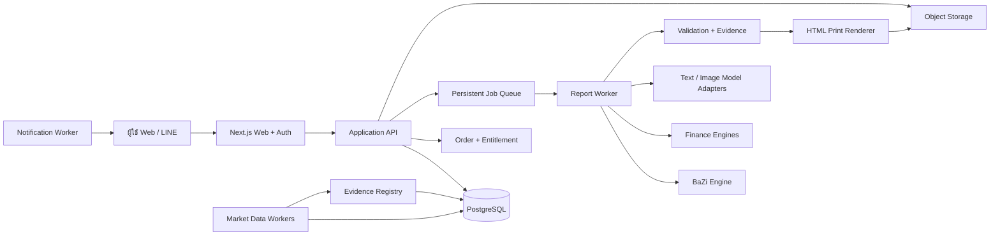

# Master Plan — ระบบรายงาน BaZi Investor PDF สำหรับใช้งานจริง

> วันที่จัดทำ: 8 สิงหาคม 2569  
> สถานะ: **Canonical plan / เอกสารแม่บทหลัก**  
> เป้าหมาย: ทำให้รายงานใช้ได้กับผู้ใช้หลายคน หลายราคา ข้อมูลไม่ปะปน คุณภาพสม่ำเสมอ และส่งมอบซ้ำได้  
> ผลประเมินต้นทาง: [`pdf-buyer-audit-2026-08-08.md`](./pdf-buyer-audit-2026-08-08.md)  
> คู่มือย้ายเครื่อง: [`../PROJECT-HANDOFF.md`](../PROJECT-HANDOFF.md)

## 0. วิธีใช้เอกสารนี้

เอกสารนี้เป็นแหล่งอ้างอิงหลักสำหรับงาน PDF รุ่นถัดไป หากขัดกับเอกสารขายหรือสเปกเก่าใน `docs/offers/` ให้ยึดเอกสารนี้ก่อน โดยเฉพาะเรื่องต่อไปนี้:

- ของฟรีต้องเป็นผลิตภัณฑ์ที่จบสมบูรณ์ ไม่ใช่หน้าล็อกหรือเนื้อหาที่ตั้งใจทำให้ด้อย
- Tier ที่สูงขึ้นต้องเพิ่มความลึก ความสด และความเฉพาะบุคคล ไม่ใช่เพิ่มหน้าเปล่า
- BaZi เป็นเลนส์อธิบายพฤติกรรมและการวางแผน ไม่ใช่เครื่องทำนายราคาหุ้นหรือวันซื้อขาย
- คำแนะนำทางการเงินต้องถูกจำกัดด้วยข้อมูลการเงินจริงของผู้ใช้
- รายงานแบบเสียเงินห้ามใช้ตัวเลขสาธิตโดยไม่ระบุชัด และห้ามแสดงค่าทดลองเหมือนข้อมูลจริง

เอกสารเก่ายังเก็บไว้เป็นประวัติความคิดและข้อมูลตลาด แต่ไม่ใช่ Product Contract ของ PDF รุ่นใหม่

---

## 1. Product North Star

ผลิตภัณฑ์นี้ไม่ใช่ “ดวงบวกตารางหุ้น” แต่เป็น:

> **คู่มือปฏิบัติการด้านเงินเฉพาะบุคคล ที่ใช้ BaZi เพื่อทำความเข้าใจพฤติกรรม ใช้ข้อมูลการเงินจริงเพื่อกำหนดขอบเขต ใช้ข้อมูลตลาดเพื่อทดสอบสมมติฐาน และใช้แผนติดตามเพื่อให้ผู้ซื้อทำต่อได้จริง**

### คุณค่าที่ผู้ซื้อควรได้รับ

1. **รู้ตัวเอง** — จุดแข็ง จุดเสี่ยง และรูปแบบการตัดสินใจเรื่องเงิน
2. **รู้สถานะจริง** — เงินสด หนี้ กระแสเงินสด เป้าหมาย และพอร์ต
3. **รู้ข้อจำกัด** — ลงทุนได้เท่าไร รับการลดลงได้เท่าไร ต้องใช้เงินเมื่อใด
4. **รู้ทางเลือก** — สัดส่วนพอร์ตหรือกลุ่มสินทรัพย์ที่ควรนำไปศึกษา พร้อมเหตุผล
5. **รู้สิ่งที่ต้องทำ** — งาน 30/90/365 วัน มีตัวเลขและวันทบทวน
6. **รู้สิ่งที่เปลี่ยน** — รายเดือนบอก Delta ไม่ใช่ทำหนังสือเดิมใหม่ทั้งเล่ม

### กฎคุณค่ารายหน้า

ทุกหน้าต้องตอบคำถามเดียวให้ชัด และเดินตามโครงนี้:

```text
ข้อเท็จจริง → ความหมาย → ผลต่อชีวิต/พอร์ต → สิ่งที่ต้องทำ → วันที่ทบทวน
```

หน้าที่ไม่มีข้อเท็จจริงใหม่ ไม่มีคำอธิบายใหม่ และไม่มีการกระทำใหม่ ต้องถูกรวม ตัด หรือย้ายไปภาคผนวก

---

## 2. ภาพรวมระบบปัจจุบัน

### 2.1 สิ่งที่มีแล้วและควรนำไปต่อยอด

| ความสามารถ | ตำแหน่งปัจจุบัน | การตัดสินใจ |
|---|---|---|
| BaZi deterministic engine | `src/lib/bazi/` | เก็บเป็น Core Domain และเพิ่ม version ของกฎ |
| Investor persona/timeline | `src/lib/investor/` | แยก “ข้อเท็จจริงจากดวง” ออกจาก “คำแนะนำทางการเงิน” |
| Market/fundamental snapshots | `src/lib/market/`, `data/cache/` | เพิ่ม provenance, as-of และ freshness policy |
| คลังหุ้นและธาตุ | `data/stocks/`, `docs/data-spec.md` | เก็บและเพิ่ม review trail ที่บังคับใช้จริง |
| Personal dashboard | `src/lib/portfolio/personal-dashboard.ts` | แยกเป็น Facts Builder ไม่ให้สร้างข้อสรุปเกินข้อมูล |
| Monthly picks | `src/lib/picks/monthly-picks.ts` | เปลี่ยนชื่อผลลัพธ์เป็น Research Candidates และเพิ่ม portfolio fit |
| Narrative v4/v5/v6 | `src/lib/report/` | ยุบเหลือ pipeline เดียว มี schema และ prompt version |
| HTML print | `src/app/report/print/` | ใช้เป็น renderer หลัก แต่รับ `reportId` ไม่รับข้อมูลการเงินผ่าน URL |
| PDFKit | `src/api/report-pdf*.ts` | เหลือเป็น fallback/การ์ด/เอกสารสั้น ไม่ทำสองเล่มเต็มคู่ขนาน |
| API server | `scripts/api-server.ts`, `src/api/` | ค่อย ๆ ย้ายเป็น service layer ที่มี auth และ authorization |
| User JSON store | `src/lib/chat/user-store.ts` | ย้ายไปฐานข้อมูล และเก็บ adapter ชั่วคราวเพื่อ migration |
| Tests | `tests/` | เพิ่ม report isolation, financial engine, tier และ render tests |

### 2.2 ความเสี่ยงเร่งด่วนที่ต้องแก้ก่อนรองรับผู้ใช้หลายคน

| ระดับ | ปัญหา | ผลกระทบ | แนวทาง |
|---|---|---|---|
| P0 | `readBookNarrativeFromCache()` ไม่รับ profile/report key และอ่าน cache หลายไฟล์รวมกัน | เนื้อหาของผู้ใช้คนหนึ่งอาจไปอยู่ในรายงานอีกคน | อ่านด้วย `reportSnapshotId + sectionId + promptVersion` เท่านั้น |
| P0 | หน้า print มีวันเกิดและข้อมูลการเงินตัวอย่างเป็น fallback | รายงานจ่ายเงินจริงอาจใช้ข้อมูลสาธิต | Paid generation ต้องหยุดและขอข้อมูลเพิ่ม ไม่มี fallback เงียบ |
| P0 | ข้อมูลการเงินส่งผ่าน query string | รั่วใน browser history, logs และ analytics ได้ | ส่งผ่าน authenticated POST และเก็บเป็น server-side snapshot |
| P0 | HTML tier ใช้ป้าย Tier แต่ยังไม่ได้บังคับ module contract ทั้งระบบ | ผู้ใช้แต่ละราคาอาจได้เนื้อหาเหมือนกันหรือเข้าถึงเกินสิทธิ์ | Server สร้าง immutable manifest ตาม entitlement |
| P0 | มีข้อความ/หุ้น/ภาพบางส่วนผูกกับโปรไฟล์ตัวอย่างโดยตรงในหน้า | รายงานคนอื่นไม่เฉพาะบุคคลจริง | ทุกข้อความต้องมาจาก View Model หรือ conditional module |
| P1 | โปรไฟล์เก็บเป็น JSON ในเครื่อง ไม่มี auth/ownership | ไม่รองรับหลายเครื่อง สำรองยาก และเสี่ยงเปิดข้อมูลข้ามคน | Database + identity + row ownership + audit log |
| P1 | ไม่มี order/payment/entitlement state | ขายจริงและดาวน์โหลดซ้ำไม่ได้อย่างปลอดภัย | Commerce state machine และ server-side authorization |
| P1 | ไม่มี immutable report snapshot | รายงานเดิมเปลี่ยนตาม cache ใหม่ ตรวจย้อนหลังไม่ได้ | เก็บ inputs, facts, data dates, rule/model/prompt versions ต่อฉบับ |
| P1 | Market data บางชุดไม่มี source/date ราย metric | ความน่าเชื่อถือต่ำ และอาจใช้ข้อมูลเก่า | Evidence registry + freshness SLA + stale badge |
| P1 | HTML และ PDFKit มีโครงเนื้อหาต่างกัน | แก้หนึ่งจุดแล้วอีกช่องทางไม่ตรง | ใช้ Report View Model เดียว และ renderer หลักหนึ่งตัว |
| P2 | ไม่มี automated render QA | รูปทับข้อความ พื้นที่ว่าง และ font เล็กอาจกลับมา | render ทุกหน้าเป็นภาพแล้วตรวจ overflow/density/visual regression |

---

## 3. Product Contract ของแต่ละ Tier

จำนวนหน้าเป็นเพียงช่วงประมาณการ ไม่ใช่ตัววัดคุณค่า

| Tier | เป้าหมาย | ข้อมูลขั้นต่ำ | เนื้อหาหลัก | เป้าหน้า |
|---|---|---|---|---:|
| ฟรี | ทำให้เข้าใจตนเองและเริ่มได้ | วันเกิด + ความมั่นใจเวลาเกิด + เป้าหมายกว้าง | Summary, BaZi behavior, จุดเสี่ยง, decision checklist, 3 งานแรก | 10–12 |
| ฿99 | Personal Money Playbook | ฟรี + รายรับ/รายจ่ายเป็นช่วง + horizon + risk answers | Money system, allocation hypothesis, decision loop, 30/90-day plan | 18–22 |
| ฿490 | แผนการเงินและพอร์ตส่วนตัว | ตัวเลขการเงินจริง + เป้าหมาย + หนี้ + holdings | Financial snapshot, goal gap, risk capacity, IPS, portfolio diagnostic, scenarios, dossiers | 30–36 |
| ฿790 | บริการติดตามต่อเนื่อง | ข้อมูลระดับ ฿490 + consent อัปเดต + baseline report | ฉบับแรก 36–44 หน้า และ Monthly Delta 12–16 หน้า | ต่อเนื่อง |

### กฎ Tier

- Free ต้องจบสมบูรณ์ ไม่มีหน้าล็อกหลายหน้าและไม่มี teaser ที่ทำให้อ่านไม่รู้เรื่อง
- ฿99 ซื้อความเฉพาะบุคคลและระบบปฏิบัติ ไม่ใช่ซื้อคำแนะนำหุ้นรายตัวลอย ๆ
- ฿490 ซื้อการวิเคราะห์จากข้อมูลจริง ความเป็นไปได้ของเป้าหมาย และผลต่อพอร์ตทั้งก้อน
- ฿790 ซื้อความสด การติดตาม การเปรียบเทียบ และการลดภาระในการทบทวน
- สิทธิ์ต้องตรวจที่ server ทั้งตอนสร้าง ดู และดาวน์โหลด ไม่ใช่ซ่อนด้วย CSS หรือ client state

---

## 4. Data Intake ที่ต้องสร้าง

### 4.1 Progressive questionnaire

ไม่ควรยื่นฟอร์มยาวครั้งเดียว ให้แบ่งเป็น 5 ขั้น พร้อมแสดงความคืบหน้าและเหตุผลที่ถาม

1. **ตัวตนและดวง** — วันเกิด เวลาเกิด สถานที่ เขตเวลา ความมั่นใจของเวลา
2. **ชีวิตการเงินวันนี้** — รายรับ รายจ่าย เงินสำรอง หนี้ ผู้พึ่งพิง ประกัน
3. **เป้าหมาย** — ชื่อเป้าหมาย จำนวนเงิน วันที่ต้องใช้ ลำดับความสำคัญ
4. **ความเสี่ยงและพฤติกรรม** — ความรู้สึกเมื่อขาดทุน ประสบการณ์ ขอบเขตที่รับได้จริง
5. **พอร์ตปัจจุบัน** — เงินสด หุ้น กองทุน ตราสารหนี้ อสังหา คริปโต ต้นทุน ค่าธรรมเนียม และสกุลเงิน

ผู้ใช้ควรเลือกกรอกเป็นตัวเลขจริงหรือช่วงตัวเลขได้ รายงานต้องแสดงระดับความแม่นของข้อมูลตามสิ่งที่กรอก

### 4.2 รายการข้อมูลหลัก

| Domain | ฟิลด์สำคัญ | ใช้ทำอะไร |
|---|---|---|
| Birth | date, local time, location, timezone, time confidence | คำนวณดวงและบอกข้อจำกัดหากเวลาไม่แน่นอน |
| Household | net income, income stability, essential/discretionary expenses, dependents | กระแสเงินสดและ risk capacity |
| Liquidity | cash, emergency fund, months of runway, near-term needs | ป้องกันการลงทุนเกินตัว |
| Debt | balance, APR, monthly payment, type, secured status | จัดลำดับหนี้และคำนวณเงินลงทุนจริง |
| Goals | amount today, target date, priority, current funding, inflation assumption | Goal feasibility และ shortfall |
| Risk willingness | questionnaire answers, loss reaction, sleep-at-night threshold | ความเต็มใจรับความเสี่ยง |
| Risk capacity | horizon, liquidity, debt, dependents, income stability | ความสามารถรับความเสี่ยง |
| Portfolio | account, ticker/asset, quantity, cost basis, current value, currency, fees | Concentration, drift, overlap และ scenario |
| Experience | years, instruments used, largest loss, trading frequency, FOMO/panic history | behavioral guardrails |
| Preferences | allowed/excluded assets, countries, ethics, complexity, liquidity needs | unique constraints |
| Market evidence | source, URL/ref, metric, value, period, fetchedAt, asOf, license | ความสดและตรวจสอบย้อนกลับ |
| Progress | contributions, withdrawals, tasks, notes, review dates | Monthly Delta และ retention |

### 4.3 Data completeness และ confidence

ทุก report request ต้องคำนวณ `dataCompleteness` แยกตาม module:

- `verified` — ผู้ใช้ยืนยันหรือมาจากแหล่งข้อมูลที่ตรวจสอบแล้ว
- `provided` — ผู้ใช้กรอกแต่ยังไม่ตรวจหลักฐาน
- `estimated-range` — ผู้ใช้ให้เป็นช่วง
- `stale` — เกิน freshness SLA
- `missing` — ไม่มีข้อมูล

Paid module ที่ต้องใช้ข้อมูล `missing` ต้องไม่แต่งคำตอบ ระบบเลือกได้เพียง:

1. ขอข้อมูลเพิ่ม
2. ตัด module ออกจากฉบับและแจ้งเหตุผล
3. แสดงกรอบตัวอย่างที่ติดป้ายว่าเป็นตัวอย่างอย่างเด่นชัด โดยไม่นับเป็น personal recommendation

---

## 5. Canonical Data Model

หลักสำคัญคือแยก **ข้อมูลที่แก้ไขได้ของผู้ใช้** ออกจาก **snapshot ที่ไม่เปลี่ยนของรายงานแต่ละฉบับ**

| Entity | หน้าที่ | Key fields |
|---|---|---|
| `User` | เจ้าของบัญชี | id, identityProvider, locale, status |
| `ConsentRecord` | บันทึกความยินยอม | userId, purpose, policyVersion, grantedAt, revokedAt |
| `BirthProfile` | ข้อมูลเกิดฉบับปัจจุบัน | userId, date, time, location, timezone, confidence, chartHash |
| `FinancialProfile` | ภาพรวมการเงินที่แก้ได้ | userId, currency, income, expenses, liquidity, dependents, version |
| `Debt` | รายการหนี้ | profileId, type, balance, APR, payment, dueDate |
| `Goal` | เป้าหมายการเงิน | profileId, name, amountToday, targetDate, priority, currentFunding |
| `RiskAssessment` | ผลประเมิน willingness/capacity | profileId, answers, willingnessBand, capacityBand, effectiveBand, version |
| `PortfolioSnapshot` | ภาพพอร์ต ณ เวลาใดเวลาหนึ่ง | userId, asOf, baseCurrency, totalValue, source |
| `Holding` | สินทรัพย์ใน snapshot | snapshotId, assetId, qty, costBasis, value, currency, fees |
| `Asset` | หลักทรัพย์/สินทรัพย์ canonical | ticker, market, identifiers, sector, element review |
| `MarketSnapshot` | ข้อมูลตลาดชุดหนึ่ง | asOf, provider, fetchedAt, schemaVersion, status |
| `EvidenceItem` | หลักฐานต่อ fact/metric | type, source, asOf, value, unit, freshness, license |
| `Product` | นิยามสินค้า | code, tier, moduleManifestVersion, price, recurring |
| `Order` | คำสั่งซื้อ | userId, productId, amount, paymentStatus, idempotencyKey |
| `Entitlement` | สิทธิ์ใช้งาน | userId, productId, startsAt, endsAt, status |
| `ReportRequest` | คำขอสร้างรายงาน | userId, entitlementId, tier, locale, status, idempotencyKey |
| `ReportSnapshot` | ข้อมูล immutable ของฉบับ | requestId, inputHash, facts, rulesVersion, marketSnapshotId, createdAt |
| `ReportManifest` | รายการ module/page ที่ต้องสร้าง | reportId, tier, module versions, order |
| `ReportSection` | เนื้อหาที่ผ่าน schema | reportId, moduleId, factsUsed, content, confidence, validationStatus |
| `GenerationRun` | บันทึก AI/engine call | reportId, moduleId, provider, model, promptVersion, token/cost, status |
| `ReportArtifact` | ไฟล์ส่งมอบ | reportId, kind, objectKey, checksum, size, createdAt |
| `MonthlyReview` | Delta ระหว่างสอง snapshot | userId, baselineReportId, currentSnapshotId, changes, actions |
| `AuditEvent` | ตรวจย้อนหลัง | actor, action, entity, entityId, metadata, occurredAt |

### ข้อบังคับของ snapshot

ทุก PDF ต้องย้อนตอบได้ว่า:

- ใช้ข้อมูลผู้ใช้ชุดใด
- ใช้ข้อมูลตลาด ณ วันใด
- ใช้กฎ BaZi/finance รุ่นใด
- ใช้ prompt/model รุ่นใด
- ใช้แหล่งข้อมูลใดในแต่ละตัวเลข
- ใครหรือระบบใดอนุมัติให้เผยแพร่

---

## 6. Target Architecture

เริ่มด้วย **modular monolith** เพื่อส่งของเร็วและดูแลง่าย ไม่สร้าง microservice หลายตัวก่อนมีโหลดจริง



### โมดูลหลัก

| Module | ความรับผิดชอบ |
|---|---|
| Identity | Login, LINE/email identity, session, ownership |
| Profile | Birth, financial, goals, risk, holdings, consent |
| BaZi | คำนวณ deterministic facts และ rule version |
| Finance | Cashflow, net worth, debt, goals, risk, allocation, scenarios |
| Market Data | Fetch, normalize, source, freshness, benchmark, FX |
| Report Planner | เลือก module ตาม tier และข้อมูลที่มี |
| Content Generator | Template + structured LLM generation |
| Verifier | Fact/evidence/numeric/duplicate/compliance validation |
| Renderer | HTML/CSS → PDF + thumbnails + page metadata |
| Commerce | Product, order, payment, entitlement, refund |
| Notification | Ready/failed/monthly review ผ่าน LINE/email |
| Admin/Ops | Jobs, data freshness, report QA, prompt versions, support |

### Provider abstraction

สิ่งต่อไปนี้ต้องอยู่หลัง interface เพื่อเปลี่ยนผู้ให้บริการได้:

- Text model
- Image model
- Market/fundamental data
- Payment
- Email/LINE notification
- Object storage
- Job queue

---

## 7. Report Generation Pipeline

### 7.1 State machine

```text
created
  → waiting_for_input
  → queued
  → snapshotting
  → calculating
  → planning
  → generating
  → validating
  → rendering
  → visual_qa
  → ready
```

Failure states:

```text
needs_review | qa_failed | retry_scheduled | failed | cancelled
```

งานต้อง idempotent: การกดซ้ำหรือ webhook ซ้ำต้องไม่หักเงินซ้ำและไม่สร้างรายงานซ้ำโดยไม่จำเป็น

### 7.2 ขั้นตอนสร้างรายงาน

1. ตรวจ entitlement และ ownership
2. ตรวจข้อมูลขั้นต่ำของ Tier
3. สร้าง immutable `ReportSnapshot`
4. คำนวณ BaZi facts พร้อม rule version
5. คำนวณ finance facts และ scenarios ด้วยโค้ด deterministic
6. ล็อก market snapshot และ evidence set
7. สร้าง `ReportManifest` จาก Tier + data availability
8. สร้าง section ทีละ module เป็น structured JSON
9. ตรวจ fact references, ตัวเลข, ความซ้ำ, language และ compliance
10. ประกอบ `ReportViewModel` เดียว
11. Render HTML เป็น PDF ผ่าน Chromium ใน worker
12. Render ทุกหน้าเป็นภาพสำหรับ visual QA
13. เก็บ PDF, thumbnails, manifest และ checksum ใน object storage
14. เปลี่ยนสถานะเป็น ready และแจ้งผู้ใช้

### 7.3 Cache key ที่ปลอดภัย

ห้ามอ่าน cache ด้วยเลขภาคเพียงอย่างเดียว Cache key ต้องอย่างน้อยประกอบด้วย:

```text
reportSnapshotId
+ moduleId
+ moduleVersion
+ factsHash
+ marketSnapshotId
+ promptVersion
+ modelId
+ locale
```

Cache เป็น optimization ไม่ใช่ source of truth และห้ามค้นหา “ไฟล์ล่าสุด” แบบ global เพื่อประกอบรายงานของผู้ใช้

---

## 8. Finance Engines ที่ต้องเพิ่ม

ทุกผลลัพธ์ต้องคำนวณจากโค้ดและมี unit tests ไม่ให้ LLM เป็นผู้คำนวณตัวเลขสำคัญ

### 8.1 Financial health

- Net worth
- Monthly surplus/deficit
- Emergency runway
- Debt service ratio
- High-interest debt priority
- Investable surplus
- Data completeness score

### 8.2 Goal feasibility

- Future target amount จาก inflation assumption
- Funding gap
- Required monthly contribution
- Scenario range จากผลตอบแทนสมมติหลายระดับ
- Goal status: on-track / at-risk / infeasible / missing-data

ต้องแสดงว่านี่เป็น simulation ไม่ใช่การรับประกันผลตอบแทน

### 8.3 Risk

- Willingness score จากแบบสอบถาม
- Capacity score จาก horizon/liquidity/debt/income/dependents
- Effective risk = ค่าที่อนุรักษ์นิยมกว่าระหว่าง willingness และ capacity
- Max loss in currency และ percentage
- Behavioral guardrails

### 8.4 Allocation และ IPS

- Allocation เป็นช่วง ไม่ใช่เลขเดียวที่ดูแม่นเกินจริง
- แสดง rationale, constraints และ rebalancing bands
- แยก emergency cash ออกจาก investment portfolio
- BaZi มีผลต่อ behavioral guardrails แต่ไม่ override liquidity/debt/horizon

### 8.5 Portfolio diagnostics

- Asset/sector/country/currency concentration
- Duplicate exposure และ correlated themes
- Liquidity and fee drag
- Portfolio drift จาก target
- Position sizing flags
- Portfolio-level fit ก่อน security-level fit

### 8.6 Scenario engine

อย่างน้อยต้องรองรับ:

- Market -10%, -20%, -35%
- Income loss 3 และ 6 เดือน
- Emergency withdrawal
- Dividend cut
- Inflation/interest-rate shock
- FX movement สำหรับสินทรัพย์ต่างประเทศ

ผลลัพธ์แต่ละ scenario: มูลค่าที่กระทบ, runway ใหม่, goal status ใหม่, action และ stop condition

---

## 9. Content Module Registry

รายงานต้องประกอบจาก module ไม่ใช่ component ที่ hardcode เป็นเล่มเดียว ทุก module มี contract ดังนี้:

```ts
type ReportModuleContract = {
  id: string;
  version: string;
  minimumTier: "free" | "99" | "490" | "790";
  requiredFacts: string[];
  optionalFacts: string[];
  questionAnswered: string;
  outputSchema: string;
  evidencePolicy: string;
  fallbackPolicy: "omit" | "request-input" | "labeled-example";
  renderTemplate: string;
};
```

### Module หลัก

| Module | คำถามที่ตอบ | Tier |
|---|---|---|
| Cover + identity | รายงานนี้เป็นของใครและใช้ข้อมูลวันใด | ทุก Tier |
| What this report knows | ระบบรู้อะไร ไม่รู้อะไร และมั่นใจแค่ไหน | ทุก Tier |
| Executive answers | 5–8 คำตอบสำคัญที่สุด | ทุก Tier |
| BaZi evidence map | จากองค์ประกอบใด → ตีความอย่างไร → มีผลต่อการตัดสินใจอะไร | ทุก Tier |
| Behavioral operating system | จุดแข็ง จุดเสี่ยง และ decision checklist | ทุก Tier |
| Financial snapshot | วันนี้มีฐานและข้อจำกัดอะไร | ฿490+ |
| Goal map | เป้าหมายไหน on-track และขาดเท่าไร | ฿490+ |
| Risk willingness/capacity | ใจอยากเสี่ยงเท่าไร ชีวิตรับได้เท่าไร | ฿99 แบบย่อ / ฿490 เต็ม |
| Money architecture | เงินแต่ละกองมีหน้าที่และจำนวนจริงเท่าไร | ฿99+ |
| IPS | กฎส่วนตัวในการลงทุน | ฿490+ |
| Current portfolio diagnostic | พอร์ตจริงเสี่ยงตรงไหน | ฿490+ |
| Scenario laboratory | ถ้าเหตุการณ์เปลี่ยน แผนยังรอดหรือไม่ | ฿490+ |
| Business research lens | คัดกิจการอย่างไรโดยไม่ใช้ดวงแทนงบ | ฿99+ |
| Stock dossiers | Candidate แต่ละตัวมี thesis/risk/evidence อย่างไร | ฿490+ |
| Life planning map | ใช้วัฏจักรเป็นช่วงทบทวนชีวิต ไม่ใช่ timing ตลาด | ฿99+ |
| 30/90/365 plan | ต้องทำอะไร เมื่อไร และวัดจากอะไร | ทุก Tierตามความลึก |
| Monthly delta | อะไรเปลี่ยนและต้องทำต่างจากเดิมอย่างไร | ฿790 |
| Method, sources, glossary | วิธีคำนวณ แหล่งข้อมูล และคำศัพท์ | ทุก Tier |

### Personalization proof

ทุกข้อสรุปสำคัญต้องแสดงสายเหตุผลสั้น ๆ เช่น:

```text
Fact: เงินสำรอง 2.1 เดือน + เป้าหมายใช้เงินใน 3 ปี
Interpretation: risk capacity ต่ำ แม้ willingness สูง
Action: เติมกองฉุกเฉินก่อนเพิ่มสินทรัพย์เสี่ยง
Measure: เงินสำรองถึง 6 เดือนภายในวันที่กำหนด
```

---

## 10. AI และ Image Strategy

### 10.1 แบ่งงานให้ถูกประเภท

| งาน | ผู้รับผิดชอบ |
|---|---|
| BaZi, finance, scores, scenarios, amounts | Deterministic code |
| เลือก module และ facts | Report planner |
| เรียบเรียงภาษาจาก facts | Text model |
| ตรวจตัวเลขและ evidence | Validator code |
| ภาพปก/ภาพคั่นเชิงบรรณาธิการ | Image model + asset library |
| Layout/table/chart | HTML/CSS/SVG ไม่ใช้ภาพ AI |

### 10.2 Text generation

- ใช้ structured output ผ่าน schema และ validate ด้วย Zod
- LLM เห็นเฉพาะ facts ที่อนุญาตสำหรับ module นั้น
- ห้ามให้ LLMคิดตัวเลข สัดส่วน วันที่ หรือแหล่งอ้างอิงเอง
- Temperature ต่ำสำหรับเนื้อหาข้อเท็จจริง และสูงขึ้นเล็กน้อยเฉพาะจดหมาย/บทนำ
- เก็บ provider, model, prompt version, facts hash, token, latency และ cost
- มี deterministic template fallback เมื่อ provider ล่ม
- ทำ semantic duplicate check ข้ามทุก section
- รายงานที่ fail validation ต้องไม่ถูกเผยแพร่อัตโนมัติ

### 10.3 Image generation

- ข้อเสนอเริ่มต้น: benchmark `gpt-image-2` เป็น primary แต่เก็บหลัง `ImageProvider` เพื่อเปลี่ยนรุ่นได้
- ภาพห้ามมีข้อความฝังอยู่ในภาพ ให้ HTML วางตัวอักษรทั้งหมด
- Free ใช้ curated element library ที่ cache แล้ว
- Paid ใช้ visual fingerprint จากธาตุหลัก/สมดุล/บุคลิก แต่ไม่จำเป็นต้องสร้างภาพใหม่ทุกหน้า
- หนึ่งเล่มควรมีภาพเด่นเฉพาะปกและหน้าคั่นสำคัญ ไม่ใช้ภาพเพื่อเพิ่มจำนวนหน้า
- เก็บ prompt hash, model, source assets, output checksum, aspect ratio และสิทธิ์ใช้งาน
- มี fallback image ต่อธาตุ เพื่อให้รายงานสร้างสำเร็จแม้ image provider ล่ม

### 10.4 Visual fingerprint

สร้าง token จากข้อมูลไม่ระบุตัวบุคคล เช่น:

```text
dominantElement + supportElement + strengthBand + paletteVariant + motifVariant
```

ห้ามใช้ชื่อ วันเกิด หรือข้อมูลการเงินใน image prompt

---

## 11. PDF Design System และ Rendering

### 11.1 Design rules

- A4 print-first และใช้ grid เดียวทั้งเล่ม
- Body Thai 12–13 pt, line-height ประมาณ 1.5–1.65
- ตารางไม่ต่ำกว่า 10.5 pt
- จำกัดความกว้างบรรทัดเพื่ออ่านง่าย
- หน้าคั่นเต็มหน้าใช้เฉพาะจุดเปลี่ยนภาคที่มีความหมาย
- ทุกกราฟมีคำอธิบายภาษาไทยและ conclusion ไม่ใช่แค่ตัวเลข
- ไม่ใช้ dashboard cards ซ้ำทั้งเล่ม
- เว้นพื้นที่ขาวเพื่อช่วยอ่าน แต่ต้องไม่กลายเป็น filler
- ภาพต้องอยู่ใน reserved frame ห้าม absolute overlap กับข้อความ
- Header/footer/page number และ as-of date ต้องสม่ำเสมอ

### 11.2 Renderer

- Source of truth คือ `ReportViewModel`
- Renderer หลักคือ server-side Chromium/HTML print
- Dev preview ใช้ `/report/print?reportId=...`
- Production user ไม่ต้องกด `window.print`; worker สร้าง PDF ให้
- PDFKit ใช้เฉพาะ free card, receipt หรือ emergency fallback
- Fonts และ image assets ต้อง package หรืออยู่ใน object storage ที่มี version

### 11.3 Render QA

ทุก artifact ต้องผ่าน:

- Page count และ section order ตรง manifest
- ไม่มี text overflow/clipping
- ไม่มี image/text overlap
- ไม่มี blank page ที่ไม่ได้ประกาศ
- table row ไม่ตัดผิดหน้า
- footer/page number ไม่หาย
- font พร้อมใช้งานและมี selectable text
- color contrast ผ่านเกณฑ์ภายใน
- thumbnail montage review สำหรับทุกหน้า
- visual regression เทียบ golden fixtures

---

## 12. Tier, Commerce และ Delivery

### 12.1 Commerce state

```text
order_created → awaiting_payment → paid → entitlement_active
                              ↘ failed / expired / refunded
```

- ทุก payment callback ต้องมี signature verification และ idempotency
- Manual PromptPay MVP ต้องมี admin verify, receipt evidence และ audit trail
- เมื่อมี gateway ให้เปลี่ยนผ่าน `PaymentProvider` โดยไม่กระทบ report pipeline
- Refund/chargeback ต้องปรับ entitlement และเก็บเหตุการณ์ย้อนหลัง

### 12.2 Delivery

- ผู้ใช้เห็นประวัติรายงานและดาวน์โหลดซ้ำได้
- URL ดาวน์โหลดเป็น signed URL อายุสั้น
- ชื่อไฟล์ไม่ใส่ข้อมูลอ่อนไหวเกินจำเป็น
- เก็บ checksum เพื่อยืนยันว่าไฟล์ไม่เปลี่ยน
- แจ้งพร้อมใช้ผ่าน LINE/email แต่ไม่แนบข้อมูลการเงินในข้อความแจ้งเตือน

### 12.3 Entitlement enforcement

ตรวจ entitlement ใน 4 จุด:

1. ก่อนสร้าง report request
2. ตอนสร้าง manifest
3. ตอนเปิดหน้า preview
4. ตอนดาวน์โหลด artifact

---

## 13. VIP Monthly Delta

ฉบับรายเดือนต้องเปรียบเทียบ baseline กับ snapshot ใหม่ ไม่ทำซ้ำเล่มเต็ม

### เนื้อหาหลัก

- Executive delta: 3–7 สิ่งที่เปลี่ยนจริง
- Financial progress: เงินสำรอง หนี้ contribution และ goal gap
- Portfolio drift: น้ำหนักที่เบี่ยงจาก IPS
- Market/fundamental changes เฉพาะสิ่งที่มีผลต่อ thesis
- New/retired research candidates พร้อมเหตุผล
- Risk alerts และ source freshness
- งานเดือนนี้และวันทบทวน
- Decision journal: เดือนก่อนทำอะไร ผลเป็นอย่างไร

### กฎไม่สร้าง noise

- ถ้าไม่มีอะไรเปลี่ยน ให้บอกว่า “ไม่เปลี่ยน” พร้อมหลักฐาน
- ไม่เปลี่ยน candidate เพียงเพราะราคาแกว่งระยะสั้น
- ไม่อ้างวันมงคลเป็นสัญญาณซื้อขาย
- ทุก change ต้องผูกกับ `previousValue`, `currentValue`, `reason`, `source`, `action`

---

## 14. Privacy, Security และ Compliance

### Privacy

- ขอข้อมูลเท่าที่จำเป็นและอธิบาย purpose ทุกกลุ่ม
- ให้ผู้ใช้ export, แก้ไข และขอลบข้อมูล
- แยกข้อมูลระบุตัวบุคคลออกจาก analytics
- เข้ารหัสข้อมูลขณะส่งและขณะเก็บตามความสามารถของ platform
- ไม่ใส่ข้อมูลการเงินใน URL, log, error message หรือ model prompt ที่ไม่จำเป็น
- มี retention policy สำหรับ raw uploads, reports, logs และ deleted accounts
- ห้าม commit `.env`, user JSON หรือข้อมูลลูกค้าจริง

### Authorization

- ทุก query ต้อง scope ด้วย authenticated user/tenant
- Admin action ต้องมี role และ audit log
- Signed artifact URL ต้องผูกกับ entitlement
- เพิ่ม multi-user isolation tests เป็น release blocker

### Financial/compliance content

- แยก label: `ข้อมูลจากผู้ใช้`, `ข้อมูลตลาด`, `ผลคำนวณ`, `การตีความ BaZi`, `สมมติฐาน`
- มี as-of date และ sources ในรายงาน
- ห้ามสัญญาผลตอบแทนหรือใช้คำว่า “จะรวย” เป็นข้อเท็จจริง
- ห้ามใช้วันดวงเป็นคำสั่งซื้อ/ขาย
- Stock pages ใช้คำว่า research candidate/ประเด็นศึกษา
- ก่อนขายจริงต้องให้ผู้เชี่ยวชาญกฎหมายไทยตรวจข้อความการตลาด ขอบเขตบริการ การเก็บข้อมูล และ disclaimer

---

## 15. Admin และ Operations

หน้า admin ที่จำเป็น:

| หน้า | ต้องเห็น/ทำอะไรได้ |
|---|---|
| Users | สถานะบัญชี consent และ entitlement โดยไม่เปิดข้อมูลเกินจำเป็น |
| Orders | payment state, verify, refund, audit |
| Report Jobs | queue, progress, retry, failure reason, cancel |
| Report QA | preview, score, failed checks, approve/reject |
| Data Freshness | provider status, last success, stale assets, license |
| Evidence | metric/source/as-of และ report ที่นำไปใช้ |
| Prompt/Model | active version, eval score, cost, rollback |
| Assets | image versions, fallback, usage rights |
| Support | resend link, regenerate from same snapshot, issue log |

### Observability

เก็บ metric อย่างน้อย:

- report success/failure rate
- queue wait และ generation duration ต่อ module
- model cost ต่อ report/tier
- cache hit rate
- data freshness failures
- validation/visual QA failures
- download success
- funnel: start questionnaire → complete → pay → report ready
- refund/support reasons
- monthly retention และ report opened rate

ต้องมี alert เมื่อ paid report fail, data source stale, payment mismatch หรือ user isolation test fail

---

## 16. Quality Gates และ Evals

### 16.1 Automated content gates

- Paid report มี demo value = 0
- Numeric claim อ้างถึง deterministic fact/evidence = 100%
- Market metric มี as-of/source = 100%
- Required module completeness = 100%
- Paragraph similarity ข้ามหน้าไม่เกิน threshold ที่กำหนด
- ไม่มีคำสั่งลงทุนที่ต้องห้าม
- ไม่มี invented ticker, source หรือ user fact
- Data confidence แสดงตรงกับข้อมูลที่มี

### 16.2 Test matrix

Core fixtures ขั้นต่ำ:

- 5 ธาตุหลัก
- 3 strength bands
- 4 tiers
- รวม 60 happy-path reports

Edge cases เพิ่มเติม:

- ไม่รู้เวลาเกิด
- วันเกิดใกล้ solar term/timezone boundary
- ไม่มีข้อมูลการเงิน
- รายรับติดลบหรือผันผวนสูง
- หนี้ดอกเบี้ยสูง
- ไม่มีพอร์ต
- พอร์ตสินทรัพย์เดียวกระจุกตัว
- พอร์ตหลายสกุลเงิน
- เป้าหมายระยะสั้นกว่า 1 ปี
- ผู้เกษียณหรือมีผู้พึ่งพิงหลายคน
- market data stale/provider down
- model timeout/invalid JSON
- image provider down
- ผู้ใช้สองคนสร้างพร้อมกัน

### 16.3 Human review rubric

ให้คะแนน 1–5 ใน 7 มิติ:

1. ความถูกต้อง
2. ความเฉพาะบุคคล
3. ความเข้าใจง่าย
4. ความนำไปใช้ได้
5. ความไม่ซ้ำ
6. ความคุ้มราคา
7. ความสวยและอ่านง่าย

Paid launch gate: ค่าเฉลี่ยแต่ละมิติไม่น้อยกว่า 4 และไม่มี critical fact/privacy defect

---

## 17. Migration Plan จากโค้ดปัจจุบัน

| ปัจจุบัน | เป้าหมาย | วิธีเปลี่ยนโดยไม่ทิ้งงานเดิม |
|---|---|---|
| `src/lib/chat/user-store.ts` JSON | Repository interface + database | สร้าง adapter DB แล้วมี one-time importer สำหรับ local JSON |
| `buildPersonalDashboard()` | `buildBaziFacts()` + `buildReportFacts()` | แยก fact ออกจาก presentation/recommendation ทีละส่วน |
| `narrative.ts`, `v5`, `v6` | Module generator เดียว | อ่าน cache เก่าเฉพาะ migration และหยุดเพิ่ม version file ใหม่ |
| `readBookNarrativeFromCache()` | `loadSection(reportId,moduleId)` | แก้ P0 ก่อนทดสอบหลายผู้ใช้ |
| Query-string IPS | Authenticated financial profile | ชั่วคราวรับ `reportId`; ห้าม URL มียอดเงิน |
| Hardcoded print pages | Registry-driven `ReportViewModel` | ย้ายทีละ module โดยใช้ v5 visual components เดิม |
| HTML tier badge | Server manifest | หน้า render ได้เฉพาะ module ที่ manifest ส่งมา |
| PDFKit full report | HTML renderer | เก็บ PDFKit เฉพาะ card/fallback แล้วหยุด mirror หนังสือเต็ม |
| File market cache | Versioned market snapshot | เริ่มด้วย metadata wrapper ก่อนย้าย storage |
| Local output folder | Object storage artifact | เก็บ local adapter สำหรับ dev |

### Proposed code boundaries

```text
src/
  domain/
    profile/
    finance/
    reporting/
    commerce/
  services/
    bazi-facts/
    finance-engines/
    report-planner/
    report-generator/
    report-validator/
    report-renderer/
  adapters/
    database/
    market-data/
    models/
    payments/
    storage/
    notifications/
  jobs/
    report-worker/
    market-refresh/
    monthly-review/
```

ไม่จำเป็นต้องย้ายทุกไฟล์พร้อมกัน ให้สร้าง interface แล้วเปลี่ยน caller ทีละชุด

---

## 18. Roadmap การพัฒนา

ประมาณการสำหรับนักพัฒนาหลัก 1 คนและมีผู้ช่วยตรวจเนื้อหา/การเงิน ระยะเวลาจริงขึ้นกับ provider, payment และการ review

### Phase 0 — Safety & Specification Freeze (2–4 วัน)

- [ ] แก้ narrative cache isolation
- [ ] หยุด fallback ข้อมูลสาธิตสำหรับ paid flow
- [ ] เอาข้อมูลการเงินออกจาก URL
- [ ] เพิ่ม `reportId`, `reportSnapshotId`, `moduleId`
- [ ] ทำ tier manifest v1 และ server-side gate
- [ ] แยก hardcoded sample copy จาก dynamic content
- [ ] สร้าง fixture ผู้ใช้ 2 คนและ concurrency isolation test
- [ ] เลือก/commit เฉพาะ visual assets ที่เป็น source of truth

**Exit gate:** สร้างรายงานของผู้ใช้ A และ B พร้อมกันแล้วไม่มี facts, narrative, image หรือ artifact ปะปน

### Phase 1 — Identity, Database, Ownership (5–8 วัน)

- [ ] Database schema + migrations
- [ ] Auth identity และ session
- [ ] User/BirthProfile/Consent repositories
- [ ] Importer จาก `data/users/*.json`
- [ ] Report request/job/artifact tables
- [ ] Local/object storage adapters
- [ ] Audit events และ authorization middleware

**Exit gate:** ผู้ใช้ล็อกอิน กรอกวันเกิด สร้าง request และเห็นเฉพาะรายงานของตนเองหลังเปลี่ยนเครื่อง/server

### Phase 2 — Financial Intake & Engines (7–12 วัน)

- [ ] Questionnaire 5 ขั้น + autosave
- [ ] FinancialProfile/Debt/Goal/Risk/Portfolio schema
- [ ] Financial health engine
- [ ] Goal feasibility engine
- [ ] Risk willingness/capacity engine
- [ ] Allocation/IPS engine
- [ ] Portfolio diagnostic
- [ ] Scenario engine
- [ ] Unit tests และ labeled assumptions

**Exit gate:** ระบบสร้าง facts และ IPS จากข้อมูลจริงโดยไม่เรียก LLM และไม่ใช้ demo values

### Phase 3 — Report Pipeline v7 (8–12 วัน)

- [ ] Module registry และ manifest ตาม Tier
- [ ] Immutable facts/evidence snapshot
- [ ] Structured generation schema
- [ ] Prompt/model versioning
- [ ] Fact/numeric/source validator
- [ ] Duplicate/compliance validator
- [ ] Retry, fallback, idempotency และ cost log
- [ ] ย้ายเนื้อหา v5 เข้า module components

**Exit gate:** รายงานทุก section บอก facts ที่ใช้และผ่าน validator ก่อน render

### Phase 4 — PDF Renderer & Visual QA (5–8 วัน)

- [ ] Server-side Chromium renderer
- [ ] View Model เดียวสำหรับทุก Tier
- [ ] A4 design tokens และ reusable page patterns
- [ ] Fonts/assets packaging
- [ ] Overflow, overlap, blank-page และ font checks
- [ ] 60 fixture renders + contact sheets
- [ ] Golden visual regression

**Exit gate:** 60 core fixtures render สำเร็จ ไม่มี critical layout defect และ paid report ผ่าน human rubric

### Phase 5 — Commerce & Delivery (5–8 วัน)

- [ ] Products/Orders/Entitlements
- [ ] Payment provider adapter + manual PromptPay admin path
- [ ] Webhook idempotency
- [ ] Pricing/checkout/status/history/download pages
- [ ] Signed URLs และ resend notification
- [ ] Refund/expiry behavior

**Exit gate:** test purchase หนึ่งรายการทำครบ pay → entitlement → generate → notify → download → history

### Phase 6 — VIP Monthly Delta (5–8 วัน)

- [ ] Baseline/current snapshot diff
- [ ] Portfolio drift และ goal progress
- [ ] Evidence change detection
- [ ] Monthly module manifest
- [ ] Scheduler, notification และ decision journal
- [ ] No-change report behavior

**Exit gate:** ฉบับเดือนที่สองแสดงเฉพาะการเปลี่ยนแปลงที่ตรวจสอบได้และอ้าง baseline ถูกต้อง

### Phase 7 — Pilot & Hardening (7–14 วัน)

- [ ] ผู้ทดลอง 20–50 คน ครบหลายโปรไฟล์และ Tier
- [ ] Load/concurrency/failure recovery
- [ ] Privacy/security review
- [ ] Legal/content review
- [ ] Support/refund runbook
- [ ] Funnel/quality/retention dashboard
- [ ] ปรับจาก feedback และ freeze v1

**Exit gate:** ไม่มี P0/P1 defect เปิดค้าง, success SLA ผ่าน และผู้ทดลอง paid ให้ความคุ้มค่าเฉลี่ย ≥4/5

### ระยะรวมโดยประมาณ

**7–10 สัปดาห์** สำหรับระบบพร้อม pilot แบบจริงจัง หากทำเฉพาะ MVP ฿99 ก่อนสามารถเปิดกลุ่มเล็กได้หลัง Phase 0–4 แต่ห้ามเปิด paid หลายผู้ใช้ก่อนผ่าน isolation gate

---

## 19. Prioritized Backlog

| ID | Priority | งาน | เหตุผล |
|---|---|---|---|
| REP-001 | P0 | Profile-scoped narrative cache | ป้องกันข้อมูลข้ามผู้ใช้ |
| REP-002 | P0 | Report snapshot/ID | ทำให้รายงานตรวจย้อนหลังได้ |
| REP-003 | P0 | Remove paid demo fallback | ป้องกันรายงานผิดและเสียความเชื่อถือ |
| SEC-001 | P0 | Remove finance data from URL | ลดการรั่วใน logs/history |
| TIER-001 | P0 | Server-side module manifest | แยกสินค้าจริงตามราคา |
| REP-004 | P0 | Parameterize sample-specific copy/assets | รองรับดวงคนอื่น |
| TST-001 | P0 | Two-user concurrent isolation test | Release blocker |
| DB-001 | P1 | Database/repository foundation | รองรับหลายเครื่องและหลายคน |
| AUTH-001 | P1 | Identity/ownership/consent | ปลอดภัยและตรวจสิทธิ์ได้ |
| FIN-001 | P1 | Financial intake schema/UI | วัตถุดิบหลักของรายงานมีราคา |
| FIN-002 | P1 | Financial health + goal engines | ทำให้รายงานใช้ได้จริง |
| FIN-003 | P1 | Risk/IPS/scenario engines | ทำให้ ฿490 คุ้ม |
| PORT-001 | P1 | Portfolio import/diagnostics | วิเคราะห์พอร์ตทั้งก้อน |
| EVD-001 | P1 | Evidence registry/freshness | เพิ่มความน่าเชื่อถือ |
| GEN-001 | P1 | Structured module generation | ลดเนื้อหาซ้ำและ hallucination |
| VAL-001 | P1 | Fact/numeric/duplicate validator | กันรายงานคุณภาพต่ำ |
| PDF-001 | P1 | Server Chromium artifact pipeline | ส่ง PDF ได้สม่ำเสมอ |
| QA-001 | P1 | Render QA + 60 fixtures | กันปัญหารูปทับ/font/พื้นที่ว่าง |
| COM-001 | P1 | Order/entitlement/payment | ขายและดาวน์โหลดซ้ำได้ |
| VIP-001 | P2 | Monthly delta engine | คุณค่าหลักของ recurring |
| OPS-001 | P2 | Admin jobs/data/report QA | ดูแลระบบจริง |
| OBS-001 | P2 | Metrics/alerts/cost | รู้ปัญหาก่อนลูกค้าแจ้ง |
| IMG-001 | P2 | Visual fingerprint + asset cache | สวยและรองรับหลายคนในต้นทุนควบคุม |

---

## 20. Launch Gates

### Free launch

- รายงานครบและจบในตัว
- ไม่มีข้อมูลผู้ใช้อื่น
- ไม่มี layout defect
- มี limitations/sources/action 3 ข้อ

### ฿99 launch

- มีข้อมูลเงินขั้นต่ำและ risk answers
- ไม่มี demo value
- มี personal money playbook และแผน 30/90 วัน
- payment/entitlement/download ทำงานครบ

### ฿490 launch

- มี financial profile, goals, debts, holdings
- IPS, portfolio diagnostics และ scenarios ผ่าน unit tests
- ทุก stock dossier มี source/as-of/risk/portfolio role
- human review rubric ≥4/5

### ฿790 launch

- มี baseline snapshot และ monthly diff
- no-change behavior ถูกต้อง
- data refresh/alert/notification พร้อม
- retention/support/refund runbook พร้อม

---

## 21. สิ่งที่ยังไม่ควรสร้าง

เพื่อไม่ให้หลุดจากคุณค่าหลัก ยังไม่ทำสิ่งเหล่านี้ก่อน v1:

- ระบบส่งคำสั่งซื้อขายหรือเชื่อม broker
- คำแนะนำภาษี/กฎหมายเฉพาะบุคคล
- Microservices หลายบริการ
- Mobile native app
- รายงาน 3 ภาษาเต็มรูปแบบก่อนภาษาไทยผ่าน quality gate
- Deep dossier หุ้นหลายพันตัวพร้อมกัน ให้ทำลึกเฉพาะ candidate ที่เข้า report
- สร้างภาพ AI ทุกหน้า
- ทำ PDFKit full book คู่ขนานกับ HTML renderer
- ทำนายราคาหรือการันตีผลตอบแทน

---

## 22. Decisions ที่ต้องล็อกก่อน Production

| Decision | ตัวเลือก | เกณฑ์ตัดสิน |
|---|---|---|
| Hosting/database/storage | ผู้ให้บริการที่รองรับ region/backup/secret | ความง่าย ต้นทุน privacy และ restore test |
| Auth | LINE + email/magic link | ผู้ใช้ไทย, account recovery, admin support |
| Payment | Manual PromptPay → gateway | webhook, refund, receipt, fee, compliance |
| Market data license | MVP source → licensed provider | commercial use, history, freshness, reliability |
| Text model | provider adapter + eval | ภาษาไทย ความถูกต้อง schema latency cost |
| Image model | configurable primary + fallback library | consistency, Thai editorial style, cost, rights |
| Retention | profile/report/log durations | ประโยชน์ธุรกิจ เทียบ privacy และกฎหมาย |
| Human review | sample vs all high tiers | ความเสี่ยงและกำลังทีม |

การเลือก provider ไม่ควรเปลี่ยน domain model หรือ Report Contract

---

## 23. Definition of Done ของระบบ v1

ระบบถือว่าพร้อมใช้งานเมื่อ:

1. ผู้ใช้สร้างบัญชี กรอกข้อมูล บันทึก และกลับมาแก้ไขได้
2. ระบบตรวจข้อมูลขั้นต่ำตาม Tier และไม่แต่งข้อมูลที่หาย
3. รายงานสองคนสร้างพร้อมกันโดยไม่มีข้อมูลหรือ asset ปะปน
4. ข้อสรุปทางการเงินคำนวณจาก deterministic engines
5. ทุก market fact มี source/as-of/freshness
6. Tier ถูกบังคับใช้ฝั่ง server
7. Report snapshot และ artifact ตรวจย้อนหลังได้
8. PDF ผ่าน content, numeric, compliance และ visual QA
9. ผู้ใช้จ่ายเงิน รับสิทธิ์ ดาวน์โหลดซ้ำ และรับแจ้งเตือนได้
10. Admin ดูงานล้มเหลว retry และตรวจรายงานได้
11. ระบบสำรองและ restore ข้อมูล/ไฟล์ผ่านการทดสอบ
12. Paid pilot ให้คะแนนความคุ้มค่าเฉลี่ยอย่างน้อย 4/5

---

## 24. งานถัดไปที่ควรเริ่มทันที

ลำดับที่ถูกต้องคือ:

1. ปิด P0 เรื่อง user isolation, demo fallback, URL data และ tier manifest
2. ออก schema ของ mutable profile และ immutable report snapshot
3. สร้าง finance engines ก่อนเพิ่มบทใหม่
4. เปลี่ยน PDF เป็น module-driven report
5. เพิ่ม commerce หลัง report pipeline ปลอดภัย
6. ทำ VIP delta หลัง baseline report มี version และ evidence ครบ

การเพิ่มหน้า เขียนบท หรือสร้างภาพใหม่ก่อนปิดข้อ 1–3 จะทำให้ต้องรื้อซ้ำ และยังไม่แก้สาเหตุที่รายงานไม่คุ้มราคา
