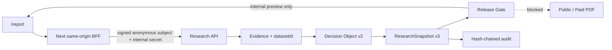

# Sprint 0C System Handoff — Release, Ownership and Research Dossier

วันที่: 9 สิงหาคม 2026  
สถานะ: code foundation และ local review พร้อม; commercial/production release ยังถูก block

## สิ่งที่เสร็จแล้ว

Sprint 0C เปลี่ยนระบบจากหน้า report ที่คำนวณคะแนนดวงแบบ legacy ไปเป็นเส้นทางข้อมูลที่ตรวจย้อนกลับได้:



- Evidence ทุกชิ้นมี `datasetId`, source, as-of, freshness และ licence status
- Personal lens มี evidence หมวด `personal_context` แยกจาก market evidence, ผูกกับ `user-private-profile` และต้องผ่าน consent ที่ยืนยันฝั่ง server
- `research-release-gate-v1` ประเมิน capability, data rights และ audit readiness
- Decision Object เป็น `decision-protocol-v2`; ResearchSnapshot เป็น schema v3
- POST research commit snapshot + audit ใน local preview; GET research ไม่มี side effect
- BFF ไม่เชื่อ `userId` จาก browser และใช้ signed HttpOnly anonymous subject
- Decision Profile/Portfolio Ledger API derive owner ID ฝั่ง serverและไม่รับ `profileId` จาก client
- `/report` แสดง answer, confidence, claims, pattern distribution, unknowns, risks, change conditions, next action, sources และ release blockers

## API ที่เพิ่ม/เปลี่ยน

| Method | Path | พฤติกรรม |
|---|---|---|
| GET | `/api/research?ticker=AAPL` | preview เท่านั้น ไม่มี file write |
| POST | `/api/research` | local preview commit snapshot + audit; production fail closed |
| GET | `/api/decision-profile` | อ่าน profile ของ signed subject เท่านั้น |
| POST | `/api/decision-profile` | validate input/consent, derive profile ID, save + audit |
| GET | `/api/portfolio-ledger` | อ่าน ledger/reconciliation ของ owner |
| POST | `/api/portfolio-ledger` | validate canonical transactions, reconcile, save + audit |

เส้นทาง legacy birth profile/chat/fortune/report/personal/PDF ถูกปิดใน production. ใน development ยังอยู่เพื่อ migration/เทียบผลเท่านั้น และไม่ใช่เส้นทางขาย.

## Environment boundary

ตั้งค่าใน production ด้วย secret จริงจาก secret manager; ห้าม commit ค่า:

```text
BAZI_SESSION_SECRET=<random, at least 32 bytes>
API_INTERNAL_SECRET=<different random secret>
API_BASE=http://127.0.0.1:8787
API_HOST=127.0.0.1
API_CORS_ORIGIN=
```

`BAZI_SESSION_SECRET` ป้องกันการแก้ anonymous subject แต่ anonymous session **ไม่ใช่ login**. Paid report, cross-device history และ account recovery ต้องใช้ authentication provider จริง.

## วิธีเปิด local review

เปิด API ก่อน:

```powershell
npm.cmd run api
```

สำหรับพัฒนา UI:

```powershell
npm.cmd run dev
```

สำหรับตรวจ artifact เดียวกับ production:

```powershell
npm.cmd run build
$env:BAZI_SESSION_SECRET="replace-with-32-plus-byte-local-secret"
$env:API_INTERNAL_SECRET="replace-with-another-32-byte-local-secret"
npm.cmd run start
```

รอบ QA นี้พบว่า in-app browser ไม่ attach client events กับ Next dev runtime แม้ไม่มี console error แต่ production build hydrate ปกติ; จึงใช้ production build เป็น visual acceptance artifact. ต้องทดสอบซ้ำใน browser/เครื่อง deployment จริงก่อนสรุปว่าเป็น Next dev หรือ in-app-browser integration issue.

## Data-rights mapping ปัจจุบัน

| Evidence | Dataset | Public/Paid |
|---|---|---|
| stock identity/business catalog | `curated-security-catalog` | Block จนยืนยันสิทธิ์ราย record/source |
| quote/fundamentals/price series ปัจจุบัน | `yahoo-development-market` | Development only |
| official security event | `official-security-events` | ต้อง source attribution + legal review |
| personal chart reference | `user-private-profile` | ห้าม public display; internal/paid ต้องผ่าน `user_consent` |
| system-created derived analysis | `application-owned-analysis` | ใช้ได้ตาม internal policy แต่ห้ามฝัง source data ที่จำกัด |
| unknown source | `unclassified-source` | Fail closed ทุก use |

ดังนั้น report AAPL ที่เห็นผ่านเฉพาะ `internal_research` และต้องแสดงว่า public/paid ยังไม่ผ่าน. นี่เป็นพฤติกรรมที่ตั้งใจ ไม่ใช่ defect.

## Persistence boundary

โฟลเดอร์ต่อไปนี้เป็น single-process local preview:

- `data/cache/research-snapshots/`
- `data/audit-log/`
- `data/decision-profiles/`
- `data/portfolio-ledgers/`

ห้าม deploy เป็น production database เพราะไม่มี transaction ข้ามไฟล์, multi-instance locking, encryption at rest, backup/restore, retention, deletion/export workflow หรือ durable audit sink. Production handlers ถูกตั้งให้ fail closed.

## Regression evidence

- 77 test files / 411 tests ผ่าน
- `npm.cmd run typecheck` ผ่าน
- targeted ESLint ของไฟล์ Sprint 0C ผ่าน
- `npm.cmd run build` ผ่าน (Next.js 16.3.0)
- global ESLint baseline: 17 errors / 1 warning ใน legacy files
- production browser QA: AAPL flow, source links, release blockers, no console error, desktop no root overflow, mobile no root overflow

## งานถัดไปตามลำดับ dependency

1. Account authentication + transactional encrypted database + row-level authorization
2. Production audit sink, rate limiting, monitoring, deletion/export และ incident controls
3. Licensed market/fundamental/EOD datasets พร้อม contract/legal record ใน registry
4. Server-side entitlement/billing; ห้ามเชื่อ tier/query จาก client
5. Decision Profile onboarding + encrypted birth-profile vault + consent withdrawal
6. Decision Inbox/Journal/Watch conditions
7. Free/฿99 PDF จาก ResearchSnapshot เดียวกับเว็บ; ฿490/฿790 หลัง Portfolio/continuity พร้อม

## Release verdict

- พร้อม: architecture contract, local product review, automated regression, truthful trust UI
- ยังไม่พร้อม: public launch, paid report, account recovery, multi-device, personalized ranking/timing, production storage
- ห้ามทำ: exact peak claim, guaranteed return, BaZi-driven buy/sell signal, client-controlled entitlement/user ID
